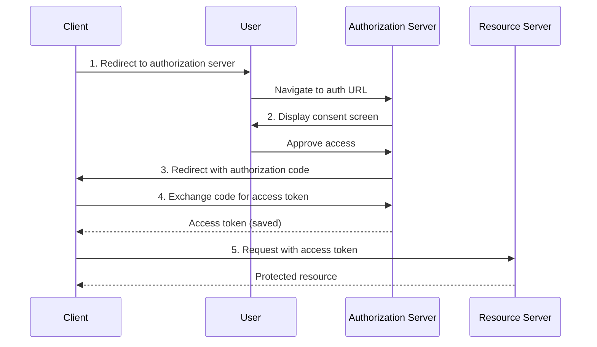
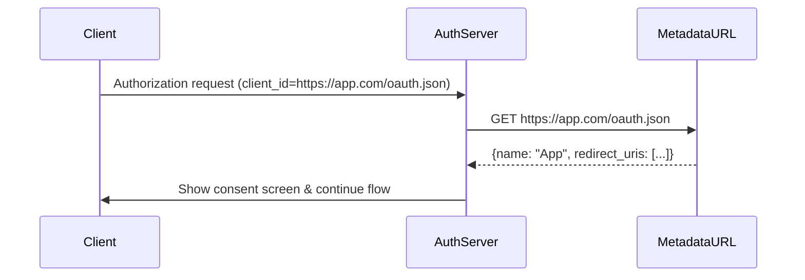

+++
date = '2025-08-22T10:00:00Z'
draft = false
title = 'Model Context Protocol 中 OAuth 客户端注册的演变'
author = 'Paul Carleton (Core Maintainer)'
tags = ['security', 'authorization']
+++

Model Context Protocol (MCP) 已采用 OAuth 2.1 作为其授权框架的基础。授权流程中 MCP 特别依赖的关键部分是**客户端注册**。

这在客户端和服务器没有预先存在的关系的世界中尤其重要——我们不能假设我们总是知道哪些 MCP 客户端将连接到哪些 MCP 服务器。这种设计突显了两个需要解决的挑战：

- 通过 [动态客户端注册](https://datatracker.ietf.org/doc/html/rfc7591) (DCR) 管理客户端 ID 的操作问题
- 防止客户端冒充

如果您已经熟悉 OAuth 以及 MCP 中客户端注册的当前状态，请跳到 [MCP 客户端注册中的两个不同挑战](#two-distinct-challenges-in-mcp-client-registration)。

## OAuth 背景

实现 OAuth 2.1 的受保护 MCP 服务器应该允许用户授予客户端访问自己的权限，并防止通过钓鱼攻击诱骗用户授予他们不打算使用的客户端访问权限。

授权流程可以通过查看这个序列图来最好地描述：

这个流程需要执行几个步骤来获取访问令牌：

1. 客户端将用户定向到授权服务器提供的授权 UI
2. 授权服务器向用户显示同意屏幕
3. 用户批准客户端访问，授权服务器将用户重定向回客户端并附带授权代码
4. 客户端将授权代码交换为一组令牌，这些令牌在本地缓存
5. 客户端使用访问令牌访问 MCP 服务器

然而，要能够启动这个流程，授权服务器首先需要一些关于启动授权流程的客户端的基本信息：

1. **客户端名称**：在同意屏幕中显示的可读文本，帮助用户决定是否要授予访问权限。
2. **重定向 URL**：如果用户同意，将授权代码发送回的目的地。

为了防止恶意客户端诱骗用户授予他们不打算授予的访问权限，授权服务器必须能够信任它拥有的客户端信息。

例如，恶意客户端可能在同意屏幕上声称是 `Claude Desktop`，而实际上由与 Claude Desktop 开发者无关的人拥有。看到同意屏幕上的客户端信息，用户可能会授予访问权限，认为他们正在授权合法的 Claude Desktop，而没有意识到某个恶意客户端现在可以访问他们的账户。

## 改进 MCP 中的客户端注册

对于 MCP 用户，一个常见模式是通过在 MCP 客户端中直接使用其 URL 来连接到 MCP 服务器。

这与典型的 OAuth 授权模式相反，因为用户正在选择要连接的资源服务器而不是客户端开发者。这个问题因 MCP 服务器可能使用的授权服务器数量不受限制而加剧，这意味着客户端需要能够完成授权流程，无论使用哪个提供商。

一些客户端开发者已经实现了与少数授权服务器的预注册。在这种情况下，当客户端检测到它知道的授权服务器时，它不需要依赖 DCR。然而，这是一个在 MCP 生态系统的广度下无法扩展的解决方案——让每个客户端都注册到每个授权服务器是不可能的。
为了缓解这个挑战，我们着手概述我们想要通过改进客户端注册体验实现的一些目标：

1. **客户端**：客户端开发者不需要为 MCP 服务器可能使用的每个授权服务器实现预注册和分发客户端 ID。
2. **用户**：用户不需要自己经历预注册过程，并为他们连接的每个 MCP 服务器手动指定客户端 ID。
3. **授权服务器**：

- **对元数据的信任**：授权服务器有办法信任它们与客户端关联的元数据，如名称和重定向 URL。
- **每个应用的单个客户端 ID**：授权服务器可以为治理和管理目的拥有每个客户端的单个客户端 ID
- **选择性允许/拒绝**：授权服务器可以根据其策略选择性允许或拒绝客户端。
- **数据库管理**：授权服务器不需要为每个新客户端注册处理不受限制的数据库或过期流程。

目前，我们现有的客户端注册方法都没有满足所有这些要求。预注册在高度可变的环境中需要太多努力（连接到不受限制数量服务器的不受限制数量客户端），而 DCR 减少了努力但创建了许多授权服务器尚未准备好处理的运营问题。

## MCP 客户端注册中的两个不同挑战

在与 MCP 服务器实现者进行广泛讨论后，我们发现一些针对注册问题的竞争解决方案正在解决两个不同的问题：

1. **开放环境中动态客户端注册的操作限制**
2. **不同部署场景中的客户端身份和冒充风险**

## **挑战 1：动态客户端注册的操作限制**

### **DCR 模型不匹配**

DCR 设计采用现代基于 OAuth 的授权服务器中可用的预注册模式，并通过 API 使其可用。在像 MCP 这样的完全开放环境中，DCR 真的突显了开放注册端点引入的一些运营挑战：

**对于授权服务器：**

- **不受限制的数据库增长**：每次用户将客户端连接到 MCP 服务器时，除非客户端已经有一个，否则会在授权服务器中创建一个新注册。注册也不可移植，所以在 Windows 机器上使用 Claude Desktop，然后跳转到 macOS 上的 Claude Desktop 将创建两个不同的客户端注册。
- **客户端过期"黑洞"**：没有办法在不创建开放重定向漏洞的情况下告诉客户端其 ID 无效。客户端必须为客户端 ID 管理实现自己的启发式方法。
- **每个实例混淆**：即使使用相同应用程序，每个客户端实例通常也会获得自己的客户端 ID，但在不同机器或跨不同用户。从审计角度来看，授权服务器管理员可能会看到数百（如果不是数千）个相同应用程序的记录，而没有任何韵律或理由。
- **拒绝服务漏洞**：未经身份验证的 `/register` 端点写入授权服务器内的数据库，这意味着租户管理员现在需要担心速率限制或策略控制（例如，允许注册客户端的主机）。

**对于客户端：**

- **额外开销**：管理注册状态和超出访问/刷新令牌的另一个秘密
- **无有效性检查**：无法验证客户端 ID 是否仍然有效
- **不明确的生命周期**：没有关于何时重新注册或更新凭据的指导

### **解决方案：客户端 ID 元数据文档 (CIMD)**

客户端 ID 元数据文档 (CIMD)，在 [OAuth 客户端 ID 元数据文档](https://www.ietf.org/archive/id/draft-parecki-oauth-client-id-metadata-document-03.html) 中描述并由 Bluesky 实现，优雅地避开了这些运营问题。

客户端使用 HTTPS 元数据 URL 直接作为其客户端 ID，而不是注册步骤。服务器在授权时从 URL 获取元数据：

这解决了所有运营问题：

- **无不受限制的数据库增长**：服务器按需获取元数据（可以缓存以提高性能）
- **无过期管理**：URL 就是 ID——它不会过期
- **自然的每个应用模型**：每个应用程序一个 URL，而不是每个用户
- **无注册端点**：无未经身份验证的写操作

代价？客户端需要在 HTTPS URL 上托管元数据文档。对于 Web 应用程序，这很简单。对于桌面应用程序，这通常意味着在他们的后端基础设施上托管。

## **挑战 2：客户端身份和冒充**

第二个挑战与 DCR 与 CIMD 的辩论正交——它是关于信任客户端是它声称的那个人。这个问题无论注册流程如何实现都会存在。

对于基于 Web 的客户端，信任更直接，因为我们有一个与证书颁发机构绑定的 HTTPS 域。对于桌面客户端，如果客户端无法将其授权卸载到现有后端基础设施，则很难信任客户端是合法的且未修改的。

### 信任谱

我们可以在两个轴上映射冒充场景：攻击者成本和缓解复杂性。

**低攻击者成本/低缓解复杂性：基于域的攻击**

- **攻击**：注册恶意回调 URI 并声称是 `Claude Desktop`
- **成本**：诱骗用户点击链接并同意
- **缓解**：
  - 限制受信任的域/URL
  - 为未知域显示警告
  - 与 DCR 和 CIMD 都兼容

**中等攻击者成本/中等缓解复杂性：`localhost` 冒充**

- **攻击**：在 `localhost:8080` 上运行恶意应用，冒充合法客户端
- **成本**：诱骗用户运行恶意应用程序（加上同意该应用访问数据）
- **问题**：桌面应用无法持有秘密，难以证明身份

**高攻击者成本/高缓解复杂性：平台证明应用程序**

- **攻击**：让恶意客户端由受信任的权威签名
- **成本**：极高——需要破坏认证供应商流程
- **缓解**：平台系统级证明（未来工作）

### **解决方案：桌面应用程序的软件声明**

为了广泛解决中等层的客户端冒充以及防止 `localhost` 冒充，我们需要签名的软件声明。实现这将需要：

1. 客户端在其后端托管 JSON Web Key Set (JWKS)
2. 客户端通过自己的流程验证用户
3. 客户端拥有的后端服务发出一个短期、有签名的 JWT，证明客户端的身份
4. 客户端在 OAuth 流程中包含此 JWT
5. 授权服务器根据受信任的 JWKS 验证 JWT

这大大提高了客户端冒充的门槛，因为攻击者需要：

- 破坏客户端的后端基础设施，或
- 成功冒充客户端的认证流程

至关重要的是，**软件声明与 DCR 和 CIMD 都兼容**。它们不是竞争解决方案——它们是互补的安全层。

### **未来：平台级证明**

最强的保护将是平台级证明，例如让 macOS、Windows 或 Android 证明一段软件是合法的。

拥有操作系统级证明将使客户端冒充变得不合理昂贵。虽然确切的将这与软件声明结合的方式尚未原型化，但一般方向是通过 OAuth 流程线程平台级应用程序身份验证。

## **互补的前进道路**

虽然我们正在查看所有可用选项，但重要的是要注意我们不是在选择解决方案之间。我们正在探索针对不同问题的互补方法：

**对于运营问题**：我们正在考虑添加 CIMD 支持而不是 DCR

- 为向后兼容性保留 DCR
- 为新实现推荐 CIMD
- 两者都实现相同的授权目标

**对于信任问题**：在上面分层软件声明

- DCR 和 CIMD 的可选增强
- 仅在 `localhost` 冒充是关注点时才需要
- 授权服务器选择其所需的信任级别

## **安全考虑**

CIMD 和软件声明都要求授权服务器向潜在不受信任的域发出出站 HTTPS 请求。实现必须：

- 通过阻止内部网络访问来防止 SSRF 攻击
- 实现超时和大小限制
- 考虑缓存策略以提高性能
- 严格验证响应格式

如果我们采用这些方法，我们将需要良好的最佳实践和 SDK 支持，以帮助避免漏洞并为实现者提供易于使用的路径。

## **下一步**

关于这些方法的讨论正在 [规范增强提案](https://modelcontextprotocol.io/community/sep-guidelines) (SEP) 中进行：

- [SEP-991: 客户端 ID 元数据文档](https://github.com/modelcontextprotocol/specification/discussions/991)
- [SEP-1032: 带 DCR 的软件声明](https://github.com/modelcontextprotocol/specification/discussions/1032)

参与其中：在 [Discord](https://discord.gg/6CSzBmMkjX)（\#auth-wg-client-registration 频道）中加入对话，或直接在 SEP 上发表评论。

特别感谢以下人士帮助撰写这篇博客文章：Den Delimarsky、Aaron Parecki、Geoff Goodman、Andrew Block、Pieter Kasselman、Abhishek Hingnikar 和 Bobby Tiernay。
