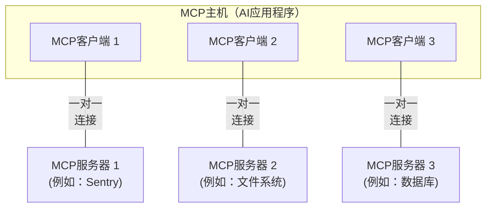

本文档概述了模型上下文协议（MCP）的[范围](#scope)和[核心概念](#concepts-of-mcp)，并提供了一个[示例](#example)来演示每个核心概念。

由于MCP SDK抽象了诸多关注点，大多数开发者可能会发现[数据层协议](#data-layer-protocol)部分最为有用。它讨论了MCP服务器如何向AI应用程序提供上下文。

有关具体实现细节，请参考您的[语言特定SDK](/docs/sdk)文档。

## 范围

模型上下文协议包括以下项目：

- [MCP规范](https://modelcontextprotocol.io/specification/latest)：MCP规范，概述了客户端和服务器的实现要求。
- [MCP SDK](/docs/sdk)：针对不同编程语言实现MCP的SDK。
- **MCP开发工具**：用于开发MCP服务器和客户端的工具，包括[MCP检查器](https://github.com/modelcontextprotocol/inspector)
- [MCP参考服务器实现](https://github.com/modelcontextprotocol/servers)：MCP服务器的参考实现。

<Note>
  MCP仅专注于上下文交换的协议——它不规定
  AI应用程序如何使用LLM或管理提供的上下文。
</Note>

## MCP的概念

### 参与者

MCP遵循客户端-服务器架构，其中MCP主机——一个AI应用程序，如[Claude Code](https://www.anthropic.com/claude-code)或[Claude Desktop](https://www.claude.ai/download)——与一个或多个MCP服务器建立连接。MCP主机通过为每个MCP服务器创建一个MCP客户端来实现这一点。每个MCP客户端与其对应的MCP服务器维护专用的点对点连接。

MCP架构中的关键参与者包括：

- **MCP主机**：协调和管理一个或多个MCP客户端的AI应用程序
- **MCP客户端**：维护与MCP服务器连接并从MCP服务器获取上下文供MCP主机使用的组件
- **MCP服务器**：向MCP客户端提供上下文的程序

**例如**：Visual Studio Code充当MCP主机。当Visual Studio Code建立与MCP服务器（如[Sentry MCP服务器](https://docs.sentry.io/product/sentry-mcp/)）的连接时，Visual Studio Code运行时实例化一个MCP客户端对象来维护与Sentry MCP服务器的连接。
当Visual Studio Code随后连接到另一个MCP服务器时，如[本地文件系统服务器](https://github.com/modelcontextprotocol/servers/tree/main/src/filesystem)，Visual Studio Code运行时实例化另一个MCP客户端对象来维护此连接，从而保持MCP客户端与MCP服务器的一对一关系。



注意，**MCP服务器**指的是提供上下文数据的程序，无论它在哪里运行。MCP服务器可以在本地或远程执行。例如，当Claude Desktop启动[文件系统服务器](https://github.com/modelcontextprotocol/servers/tree/main/src/filesystem)时，由于它使用STDIO传输，服务器在同一台机器上本地运行。这通常被称为"本地"MCP服务器。官方[Sentry MCP服务器](https://docs.sentry.io/product/sentry-mcp/)在Sentry平台上运行，并使用可流式HTTP传输。这通常被称为"远程"MCP服务器。

### 层级

MCP由两层组成：

- **数据层**：定义基于JSON-RPC的客户端-服务器通信协议，包括生命周期管理以及核心原语，如工具、资源、提示和通知。
- **传输层**：定义启用客户端和服务器之间数据交换的通信机制和通道，包括特定于传输的连接建立、消息分帧和授权。

从概念上讲，数据层是内层，而传输层是外层。

#### 数据层

数据层实现基于[JSON-RPC 2.0](https://www.jsonrpc.org/)的交换协议，定义消息结构和语义。
此层包括：

- **生命周期管理**：处理客户端和服务器之间的连接初始化、能力协商和连接终止
- **服务器功能**：使服务器能够提供核心功能，包括用于AI操作的工具、用于上下文数据的资源，以及用于与客户端交互的模板提示
- **客户端功能**：使服务器能够从主机LLM采样、从用户获取输入，并向客户端记录消息
- **实用功能**：支持额外功能，如用于实时更新的通知和用于长时间运行操作的进度跟踪

#### 传输层

传输层管理客户端和服务器之间的通信通道和身份验证。它处理连接建立、消息分帧以及MCP参与者之间的安全通信。

MCP支持两种传输机制：

- **Stdio传输**：使用标准输入/输出流在同一台机器上的本地进程之间进行直接进程通信，提供最佳性能且无网络开销。
- **可流式HTTP传输**：使用HTTP POST进行客户端到服务器的消息，可选的服务器发送事件用于流式功能。此传输启用远程服务器通信，并支持标准HTTP身份验证方法，包括承载令牌、API密钥和自定义标头。MCP推荐使用OAuth获取身份验证令牌。

传输层从协议层抽象通信细节，使相同的JSON-RPC 2.0消息格式能够在所有传输机制中使用。

### 数据层协议

MCP的核心部分是定义MCP客户端和MCP服务器之间的模式和语义。开发者可能会发现数据层——特别是[原语](#primitives)集合——是MCP最有趣的部分。它是MCP定义开发者如何从MCP服务器向MCP客户端共享上下文的部分。

MCP使用[JSON-RPC 2.0](https://www.jsonrpc.org/)作为其底层RPC协议。客户端和服务器相互发送请求并相应响应。当不需要响应时可以使用通知。

#### 生命周期管理

MCP是一个<Tooltip tip="使用可流式HTTP传输可以使MCP的子集变为无状态">有状态协议</Tooltip>，需要生命周期管理。生命周期管理的目的是协商客户端和服务器都支持的<Tooltip tip="客户端或服务器支持的功能和操作，如工具、资源或提示">能力</Tooltip>。详细信息可以在[规范](/specification/2025-06-18/basic/lifecycle)中找到，[示例](#example)展示了初始化序列。

#### 原语

MCP原语是MCP内最重要的概念。它们定义客户端和服务器可以相互提供什么。这些原语指定可以与AI应用程序共享的上下文信息的类型以及可以执行的操作范围。

MCP定义了三个核心原语，_服务器_可以暴露这些原语：

- **工具**：AI应用程序可以调用的可执行函数，用于执行操作（例如：文件操作、API调用、数据库查询）
- **资源**：向AI应用程序提供上下文信息的数据源（例如：文件内容、数据库记录、API响应）
- **提示**：帮助构建与语言模型交互的可重用模板（例如：系统提示、少样本示例）

每种原语类型都有用于发现（`*/list`）、检索（`*/get`）的相关方法，在某些情况下还有执行（`tools/call`）。
MCP客户端将使用`*/list`方法来发现可用原语。例如，客户端可以首先列出所有可用工具（`tools/list`），然后执行它们。这种设计允许列表是动态的。

作为一个具体示例，考虑一个提供数据库上下文的MCP服务器。它可以暴露用于查询数据库的工具、包含数据库模式的资源，以及包含与工具交互的少样本示例的提示。

有关服务器原语的更多详细信息，请参见[服务器概念](./server-concepts)。

MCP还定义了_客户端_可以暴露的原语。这些原语允许MCP服务器作者构建更丰富的交互。

- **采样**：允许服务器从客户端的AI应用程序请求语言模型补全。当服务器作者想要访问语言模型，但希望保持模型独立且不在其MCP服务器中包含语言模型SDK时，这很有用。他们可以使用`sampling/complete`方法从客户端的AI应用程序请求语言模型补全。
- **征集**：允许服务器从用户请求额外信息。当服务器作者想要从用户获取更多信息，或请求确认操作时，这很有用。他们可以使用`elicitation/request`方法从用户请求额外信息。
- **日志记录**：使服务器能够向客户端发送日志消息以进行调试和监控。

有关客户端原语的更多详细信息，请参见[客户端概念](./client-concepts)。

#### 通知

协议支持实时通知，以在服务器和客户端之间启用动态更新。例如，当服务器的可用工具发生变化时——如新功能变得可用或现有工具被修改时——服务器可以发送工具更新通知来通知连接的客户端这些变化。通知作为JSON-RPC 2.0通知消息发送（无需响应），并使MCP服务器能够向连接的客户端提供实时更新。

## 示例

### 数据层

本节提供MCP客户端-服务器交互的分步演练，重点关注数据层协议。我们将使用JSON-RPC 2.0消息演示生命周期序列、工具操作和通知。

<Steps>
<Step title="初始化（生命周期管理）">

MCP以生命周期管理开始，通过能力协商握手。如[生命周期管理](#lifecycle-management)部分所述，客户端发送`initialize`请求来建立连接并协商支持的功能。

<CodeGroup>
  ```json 初始化请求
  {
    "jsonrpc": "2.0",
    "id": 1,
    "method": "initialize",
    "params": {
      "protocolVersion": "2025-06-18",
      "capabilities": {
        "elicitation": {}
      },
      "clientInfo": {
        "name": "example-client",
        "version": "1.0.0"
      }
    }
  }
  ```
  ```json 初始化响应
  {
    "jsonrpc": "2.0",
    "id": 1,
    "result": {
      "protocolVersion": "2025-06-18",
      "capabilities": {
        "tools": {
          "listChanged": true
        },
        "resources": {}
      },
      "serverInfo": {
        "name": "example-server",
        "version": "1.0.0"
      }
    }
  }
  ```
</CodeGroup>

#### 理解初始化交换

初始化过程是MCP生命周期管理的关键部分，具有几个重要目的：

1. **协议版本协商**：`protocolVersion`字段（例如："2025-06-18"）确保客户端和服务器都使用兼容的协议版本。这可以防止不同版本尝试交互时可能发生的通信错误。如果未协商出相互兼容的版本，则应终止连接。

2. **能力发现**：`capabilities`对象允许各方声明它们支持哪些功能，包括它们可以处理哪些[原语](#primitives)以及是否支持[通知](#notifications)等功能。这通过避免不支持的操作来实现高效通信。

3. **身份交换**：`clientInfo`和`serverInfo`对象提供用于调试和兼容性的标识和版本信息。

在此示例中，能力协商演示了如何声明MCP原语：

**客户端能力**：

- `"elicitation": {}` - 客户端声明它可以处理用户交互请求（可以接收`elicitation/create`方法调用）

**服务器能力**：

- `"tools": {"listChanged": true}` - 服务器支持工具原语，**并且**可以在其工具列表发生变化时发送`tools/list_changed`通知
- `"resources": {}` - 服务器还支持资源原语（可以处理`resources/list`和`resources/read`方法）

初始化成功后，客户端发送通知表示它已准备就绪：

```json 通知
{
  "jsonrpc": "2.0",
  "method": "notifications/initialized"
}
```

#### 这在AI应用程序中如何工作

在初始化期间，AI应用程序的MCP客户端管理器建立与配置服务器的连接，并存储其能力以供后续使用。应用程序使用此信息来确定哪些服务器可以提供特定类型的功能（工具、资源、提示），以及它们是否支持实时更新。

```python AI应用程序初始化的伪代码
# 伪代码
async with stdio_client(server_config) as (read, write):
    async with ClientSession(read, write) as session:
        init_response = await session.initialize()
        if init_response.capabilities.tools:
            app.register_mcp_server(session, supports_tools=True)
        app.set_server_ready(session)
```

</Step>

<Step title="工具发现（原语）">
现在连接已建立，客户端可以通过发送`tools/list`请求来发现可用工具。这是MCP工具发现机制的基础——它允许客户端在尝试使用工具之前了解服务器上有哪些工具可用。

<CodeGroup>
  ```json 工具列表请求
  {
    "jsonrpc": "2.0",
    "id": 2,
    "method": "tools/list"
  }
  ```
  ```json 工具列表响应
  {
    "jsonrpc": "2.0",
    "id": 2,
    "result": {
      "tools": [
        {
          "name": "calculator_arithmetic",
          "title": "计算器",
          "description": "执行数学计算，包括基本算术、三角函数和代数运算",
          "inputSchema": {
            "type": "object",
            "properties": {
              "expression": {
                "type": "string",
                "description": "要计算的数学表达式（例如：'2 + 3 * 4'，'sin(30)'，'sqrt(16)'）"
              }
            },
            "required": ["expression"]
          }
        },
        {
          "name": "weather_current",
          "title": "天气信息",
          "description": "获取全球任何地点的当前天气信息",
          "inputSchema": {
            "type": "object",
            "properties": {
              "location": {
                "type": "string",
                "description": "城市名称、地址或坐标（纬度，经度）"
              },
              "units": {
                "type": "string",
                "enum": ["metric", "imperial", "kelvin"],
                "description": "响应中使用的温度单位",
                "default": "metric"
              }
            },
            "required": ["location"]
          }
        }
      ]
    }
  }
  ```
</CodeGroup>

#### 理解工具发现请求

`tools/list`请求很简单，不包含任何参数。

#### 理解工具发现响应

响应包含一个`tools`数组，该数组为每个可用工具提供全面的元数据。这个数组结构允许服务器同时暴露多个工具，同时在不同功能之间保持清晰的边界。

响应中每个工具对象包括几个关键字段：

- **`name`**：服务器命名空间内工具的唯一标识符。这用作工具执行的主要键，应遵循清晰的命名模式（例如：`calculator_arithmetic`而不是`calculate`）
- **`title`**：客户端可以向用户显示的工具的易读显示名称
- **`description`**：详细解释工具的作用以及何时使用它
- **`inputSchema`**：一个JSON Schema，定义预期的输入参数，实现类型验证并提供关于必需和可选参数的清晰文档

#### 这在AI应用程序中如何工作

AI应用程序从所有连接的MCP服务器获取可用工具，并将它们组合成语言模型可以访问的统一工具注册表。这允许LLM理解它可以执行什么操作，并自动生成对话期间的适当工具调用。

```python AI应用程序工具发现的伪代码
# 使用MCP Python SDK模式的伪代码
available_tools = []
for session in app.mcp_server_sessions():
    tools_response = await session.list_tools()
    available_tools.extend(tools_response.tools)
conversation.register_available_tools(available_tools)
```

</Step>

<Step title="工具执行（原语）">
客户端现在可以使用`tools/call`方法执行工具。这演示了MCP原语在实践中是如何使用的：在发现可用工具后，客户端可以使用适当的参数调用它们。

#### 理解工具执行请求

`tools/call`请求遵循结构化格式，确保类型安全和客户端与服务器之间的清晰通信。请注意，我们使用发现响应中的正确工具名称（`weather_current`）而不是简化的名称：

<CodeGroup>
  ```json 工具调用请求
  {
    "jsonrpc": "2.0",
    "id": 3,
    "method": "tools/call",
    "params": {
      "name": "weather_current",
      "arguments": {
        "location": "San Francisco",
        "units": "imperial"
      }
    }
  }
  ```
  ```json 工具调用响应
  {
    "jsonrpc": "2.0",
    "id": 3,
    "result": {
      "content": [
        {
          "type": "text",
          "text": "旧金山当前天气：68°F，多云，轻微西风，风速8英里每小时。湿度：65%"
        }
      ]
    }
  }
  ```
</CodeGroup>

#### 工具执行的关键元素

请求结构包括几个重要组件：

1. **`name`**：必须与发现响应中的工具名称完全匹配（`weather_current`）。这确保服务器可以正确识别要执行哪个工具。

2. **`arguments`**：包含由工具的`inputSchema`定义的输入参数。在此示例中：
   - `location`："San Francisco"（必需参数）
   - `units`："imperial"（可选参数，如果未指定则默认为"metric"）

3. **JSON-RPC结构**：使用标准JSON-RPC 2.0格式，具有用于请求-响应关联的唯一`id`。

#### 理解工具执行响应

响应演示了MCP灵活的内容系统：

1. **`content`数组**：工具响应返回一个内容对象数组，允许丰富的多格式响应（文本、图像、资源等）

2. **内容类型**：每个内容对象都有一个`type`字段。在此示例中，`"type": "text"`表示纯文本内容，但MCP支持各种内容类型以适应不同用例。

3. **结构化输出**：响应提供可操作的信息，AI应用程序可以用作语言模型交互的上下文。

这种执行模式允许AI应用程序动态调用服务器功能并接收可集成到对话中的结构化响应，从而使LLM能够访问实时数据并在外部世界中执行操作。

#### 这在AI应用程序中如何工作

当语言模型在对话期间决定使用工具时，AI应用程序拦截工具调用，将其路由到适当的MCP服务器，执行它，然后将结果作为对话的一部分返回给LLM。这使LLM能够访问外部世界的实时数据和执行操作。

```python
# AI应用程序工具执行的伪代码
async def handle_tool_call(conversation, tool_name, arguments):
    session = app.find_mcp_session_for_tool(tool_name)
    result = await session.call_tool(tool_name, arguments)
    conversation.add_tool_result(result.content)
```

</Step>

<Step title="实时更新（通知）">
MCP支持实时通知，使服务器能够在无需明确请求的情况下通知客户端更改。这演示了通知系统，这是MCP连接保持同步和响应性的关键功能。

#### 理解工具列表更改通知

当服务器的可用工具发生变化时——如新功能变得可用、现有工具被修改或工具暂时不可用时——服务器可以主动通知连接的客户端：

```json 请求
{
  "jsonrpc": "2.0",
  "method": "notifications/tools/list_changed"
}
```

#### MCP通知的关键特性

1. **无需响应**：注意通知中没有`id`字段。这遵循JSON-RPC 2.0通知语义，不期望或发送响应。

2. **基于能力的**：只有在初始化期间声明`"listChanged": true`在其工具能力中的服务器才会发送此通知（如步骤1中所示）。

3. **事件驱动**：服务器根据内部状态变化决定何时发送通知，使MCP连接动态且响应迅速。

#### 客户端对通知的响应

收到此通知后，客户端通常会通过请求更新的工具列表来做出反应。这创建了一个刷新周期，使客户端对可用服务器能力的理解保持最新：

```json 请求
{
  "jsonrpc": "2.0",
  "id": 4,
  "method": "tools/list"
}
```

#### 为什么通知很重要

这个通知系统出于几个原因至关重要：

1. **动态环境**：工具可能基于服务器状态、外部依赖或用户权限来来去去
2. **效率**：客户端无需轮询更改；它们会在发生更改时收到通知
3. **一致性**：确保客户端始终对可用服务器功能有准确信息
4. **实时协作**：启用响应迅速的AI应用程序，可以适应不断变化的上下文

此通知模式扩展到其他MCP原语之外，启用MCP参与者之间的全面实时同步。

#### 这在AI应用程序中如何工作

当AI应用程序收到关于更改工具的通知时，它会立即刷新其工具注册表，并更新LLM的可用功能。这确保正在进行的对话始终可以访问最新工具集，并且LLM可以动态适应新功能。

```python
# AI应用程序通知处理的伪代码
async def handle_tools_changed_notification(session):
    tools_response = await session.list_tools()
    app.update_available_tools(session, tools_response.tools)
    if app.conversation.is_active():
        app.conversation.notify_llm_of_new_capabilities()
```

</Step>
</Steps>
