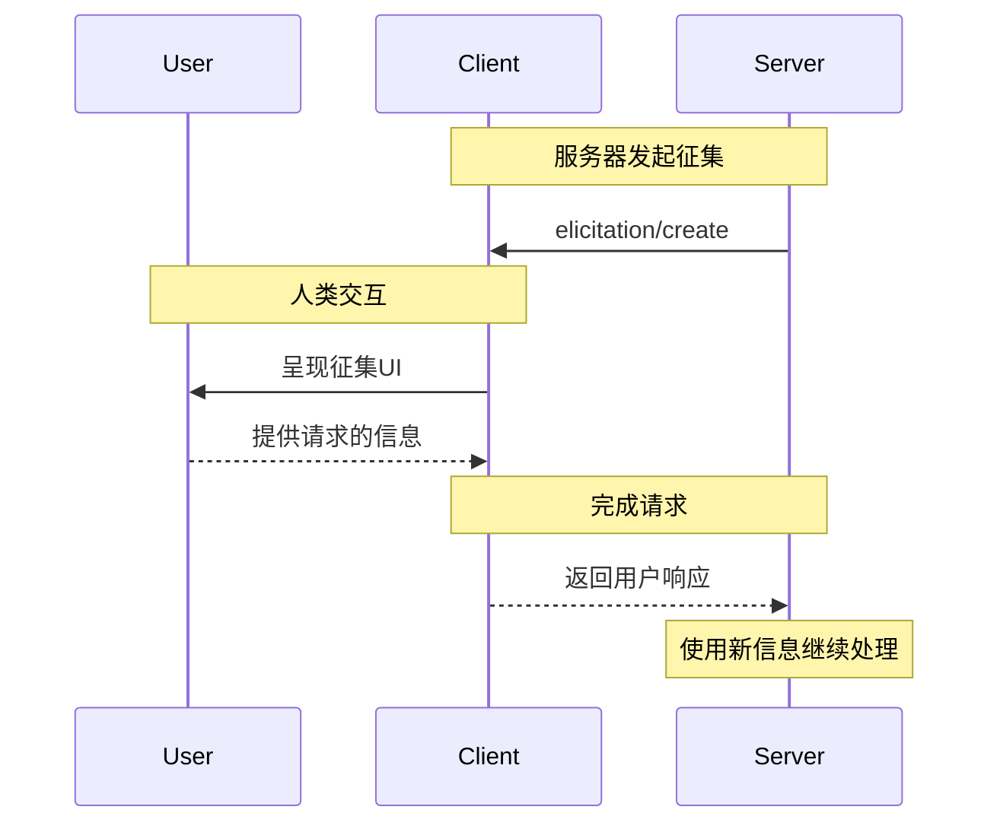
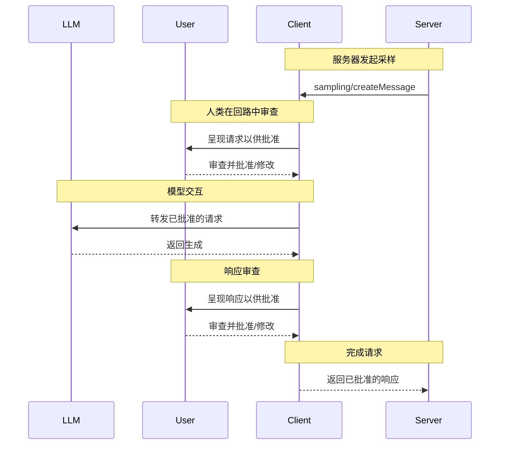

MCP客户端由主机应用程序实例化，用于与特定的MCP服务器通信。主机应用程序（如Claude.ai或IDE）管理整体用户体验并协调多个客户端。每个客户端处理与一个服务器的直接通信。

理解这种区别很重要：_主机_是用户与之交互的应用程序，而_客户端_是启用服务器连接的协议级组件。

## 核心客户端功能

除了使用服务器提供的上下文外，客户端还可以向服务器提供几个功能。这些客户端功能允许服务器作者构建更丰富的交互。

| 功能       | 解释                                                                                              | 示例                                                                             |
| ---------- | ------------------------------------------------------------------------------------------------- | -------------------------------------------------------------------------------- |
| **采样**   | 采样允许服务器通过客户端请求LLM补全，实现代理工作流。这种方法使客户端完全控制用户权限和安全措施。 | 预订旅行的服务器可能会向LLM发送航班列表，并请求LLM为用户选择最佳航班。           |
| **根目录** | 根目录允许客户端指定服务器应关注哪些目录，通过协调机制传达预期范围。                              | 预订旅行的服务器可能会被授予访问特定目录的权限，从中可以读取用户的日历。         |
| **征集**   | 征集使服务器能够在交互期间从用户请求特定信息，提供服务器按需收集信息的结构化方式。                | 预订旅行的服务器可能会询问用户对飞机座位、房间类型或联系电话的偏好，以完成预订。 |

### 征集

征集使服务器能够在交互期间从用户请求特定信息，创建更动态和响应迅速的工作流。

#### 概述

征集为服务器提供了一种按需收集必要信息的结构化方式。服务器不必要求预先提供所有信息或在数据缺失时失败，而是可以暂停操作以从用户请求特定输入。这创建了更灵活的交互，其中服务器适应用户需求而不是遵循僵化模式。

**征集流程：**



该流程启用动态信息收集。服务器可以在需要时请求特定数据，用户通过适当的UI提供信息，服务器使用新获取的上下文继续处理。

**征集组件示例：**

```typescript
{
  method: "elicitation/requestInput",
  params: {
    message: "请确认您的巴塞罗那假期预订详情：",
    schema: {
      type: "object",
      properties: {
        confirmBooking: {
          type: "boolean",
          description: "确认预订（机票 + 酒店 = 3000美元）"
        },
        seatPreference: {
          type: "string",
          enum: ["window", "aisle", "no preference"],
          description: "航班的首选座位类型"
        },
        roomType: {
          type: "string",
          enum: ["sea view", "city view", "garden view"],
          description: "酒店的首选房间类型"
        },
        travelInsurance: {
          type: "boolean",
          default: false,
          description: "添加旅行保险（150美元）"
        }
      },
      required: ["confirmBooking"]
    }
  }
}
```

#### 示例：假期预订批准

旅行预订服务器通过最终预订确认过程展示了征集的力量。当用户选择了理想的巴塞罗那假期套餐时，服务器需要在继续之前收集最终批准和任何缺失的细节。

服务器使用结构化请求征集预订确认，该请求包括行程摘要（6月15-22日巴塞罗那航班、海滨酒店、总计3000美元）以及任何额外偏好的字段——如座位选择、房间类型或旅行保险选项。

随着预订的进行，服务器征集完成预订所需的联系信息。它可能会询问飞行预订的旅行者详细信息、酒店的特殊要求或紧急联系信息。

#### 用户交互模型

征集交互设计为清晰、上下文相关并尊重用户自主性：

**请求呈现**：客户端显示征集请求，其中清楚说明哪个服务器在询问、为什么需要信息以及如何使用信息。请求消息解释目的，而模式提供结构和验证。

**响应选项**：用户可以通过适当的UI控件（文本字段、下拉菜单、复选框）提供请求的信息，拒绝提供信息并可选解释，或取消整个操作。客户端在将响应返回服务器之前根据提供的模式验证响应。

**隐私考虑**：征集从不请求密码或API密钥。客户端警告可疑请求，并让用户在发送前审查数据。

### 根目录

根目录定义服务器操作的文件系统边界，允许客户端指定服务器应关注哪些目录。

#### 概述

根目录是客户端向服务器传达文件系统访问边界的一种机制。它们由文件URI组成，指示服务器可以操作的目录，帮助服务器理解可用文件和文件夹的范围。虽然根目录传达预期边界，但它们不强制执行安全限制。实际安全必须在操作系统级别通过文件权限和/或沙盒强制执行。

**根目录结构：**

```json
{
  "uri": "file:///Users/agent/travel-planning",
  "name": "旅行规划工作区"
}
```

根目录专门是文件系统路径，始终使用`file://` URI方案。它们帮助服务器理解项目边界、工作区组织和可访问目录。根目录列表可以随着用户处理不同项目或文件夹而动态更新，服务器通过`roots/list_changed`接收边界变化的通知。

#### 示例：旅行规划工作区

处理多个客户行程的旅行代理从根目录中获益，以组织文件系统访问。考虑一个工作区，其中不同目录用于旅行规划的各个方面。

客户端向旅行规划服务器提供文件系统根目录：

- `file:///Users/agent/travel-planning` - 包含所有旅行文件的主工作区
- `file:///Users/agent/travel-templates` - 可重用的行程模板和资源
- `file:///Users/agent/client-documents` - 客户护照和旅行文件

当代理创建巴塞罗那行程时，行为良好的服务器尊重这些边界——访问模板、保存新行程，并在指定根目录内引用客户文件。服务器通常通过使用从根目录的相对路径或利用尊重根边界的文件搜索工具来访问根目录内的文件。

如果代理打开一个存档文件夹，如`file:///Users/agent/archive/2023-trips`，客户端通过`roots/list_changed`更新根目录列表。

有关尊重根目录的服务器的完整实现，请参见官方服务器仓库中的[文件系统服务器](https://github.com/modelcontextprotocol/servers/tree/main/src/filesystem)。

#### 设计理念

根目录作为客户端和服务器之间的协调机制，而不是安全边界。规范要求服务器"应该尊重根边界"，而不是"必须强制执行"它们，因为服务器运行客户端无法控制的代码。

当服务器被信任或经过审查、用户理解其建议性质以及目标是防止事故而不是阻止恶意行为时，根目录效果最佳。它们擅长上下文范围界定（告诉服务器在哪里聚焦）、事故预防（帮助行为良好的服务器保持边界内）和工作流组织（如自动管理项目边界）。

#### 用户交互模型

根目录通常由主机应用程序根据用户操作自动管理，尽管某些应用程序可能会暴露手动根目录管理：

**自动根目录检测**：当用户打开文件夹时，客户端自动将它们暴露为根目录。打开旅行工作区允许客户端将该目录暴露为根目录，帮助服务器理解哪些行程和文档在当前工作的范围内。

**手动根目录配置**：高级用户可以通过配置指定根目录。例如，在排除包含财务记录的目录时添加`/travel-templates`以获取可重用资源。

### 采样

采样允许服务器通过客户端请求语言模型补全，实现代理行为，同时维护安全性和用户控制。

#### 概述

采样使服务器能够执行依赖AI的任务，而无需直接集成或支付AI模型费用。相反，服务器可以请求客户端（已经具有AI模型访问权限）代表它们处理这些任务。这种方法使客户端完全控制用户权限和安全措施。因为采样请求发生在其他操作的上下文中——如分析数据的工具——并作为单独的模型调用处理，它们在不同上下文之间保持清晰边界，允许更有效地使用上下文窗口。

**采样流程：**



该流程通过多个人类在回路中的检查点确保安全性。用户审查并可以修改初始请求和生成响应，然后再将其返回服务器。

**请求参数示例：**

```typescript
{
  messages: [
    {
      role: "user",
      content: "分析这些航班选项并推荐最佳选择：\n" +
               "[47个带有价格、时间、航空公司和中转的航班]\n" +
               "用户偏好：上午出发，最多1次中转"
    }
  ],
  modelPreferences: {
    hints: [{
      name: "claude-3-5-sonnet"  // 建议的模型
    }],
    costPriority: 0.3,      // 对API成本不太关心
    speedPriority: 0.2,     // 可以等待彻底分析
    intelligencePriority: 0.9  // 需要复杂的权衡评估
  },
  systemPrompt: "您是旅行专家，帮助用户根据他们的偏好找到最佳航班",
  maxTokens: 1500
}
```

#### 示例：航班分析工具

考虑一个旅行预订服务器，它有一个名为`findBestFlight`的工具，使用采样来分析可用航班并推荐最佳选择。当用户询问"帮我预订下个月去巴塞罗那的最佳航班"时，该工具需要AI帮助来评估复杂的权衡。

该工具查询航空公司API并收集47个航班选项。然后它请求AI帮助来分析这些选项："分析这些航班选项并推荐最佳选择：[47个带有价格、时间、航空公司和中转的航班] 用户偏好：上午出发，最多1次中转。"

客户端发起采样请求，允许AI评估权衡——如更便宜的红眼航班与方便的上午出发相比。该工具使用此分析来呈现前三个推荐。

#### 用户交互模型

虽然不是必需的，但采样设计为允许人类在回路中的控制。用户可以通过几种机制保持监督：

**批准控制**：采样请求可能需要明确的用户同意。客户端可以显示服务器想要分析的内容以及原因。用户可以批准、拒绝或修改请求。

**透明功能**：客户端可以显示确切的提示、模型选择和令牌限制，允许用户在响应返回服务器之前审查AI响应。

**配置选项**：用户可以设置模型偏好、为受信任操作配置自动批准，或要求批准一切。客户端可以提供编辑敏感信息的选项。

**安全考虑**：客户端和服务器都必须在采样期间适当处理敏感数据。客户端应该实现速率限制并验证所有消息内容。人类在回路中的设计确保服务器发起的AI交互不能在没有明确用户同意的情况下损害安全性或访问敏感数据。
