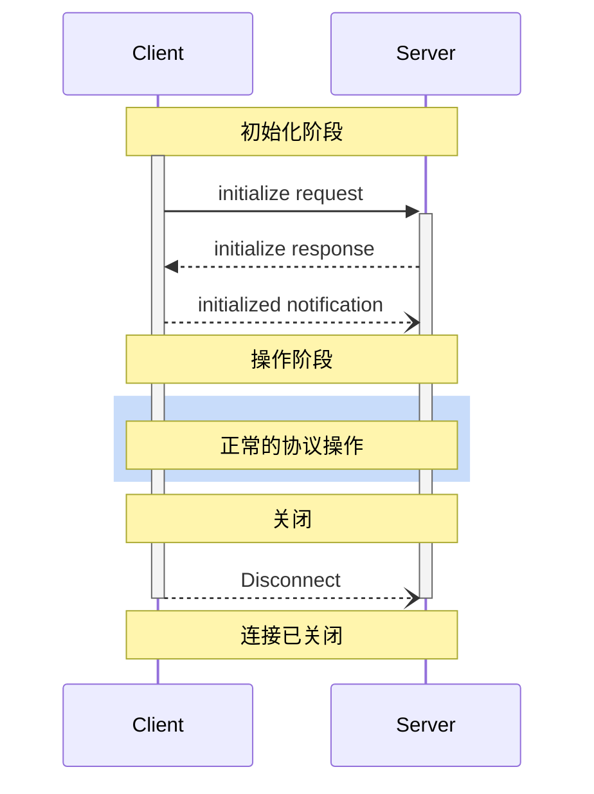

<Info>**协议修订**: 2024-11-05</Info>

Model Context Protocol (MCP) 为客户端-服务器连接定义了严格的生命周期，确保正确的功能协商和状态管理。

1. **初始化**: 功能协商和协议版本协议
2. **操作**: 正常的协议通信
3. **关闭**: 连接的优雅终止



## 生命周期阶段

### 初始化

初始化阶段**必须**是客户端和服务器之间的第一次交互。在此阶段，客户端和服务器：

- 建立协议版本兼容性
- 交换和协商功能
- 共享实现细节

客户端**必须**通过发送包含以下内容的 `initialize` 请求来启动此阶段：

- 支持的协议版本
- 客户端功能
- 客户端实现信息

```json
{
  "jsonrpc": "2.0",
  "id": 1,
  "method": "initialize",
  "params": {
    "protocolVersion": "2024-11-05",
    "capabilities": {
      "roots": {
        "listChanged": true
      },
      "sampling": {}
    },
    "clientInfo": {
      "name": "ExampleClient",
      "version": "1.0.0"
    }
  }
}
```

服务器**必须**使用自己的功能和信息进行响应：

```json
{
  "jsonrpc": "2.0",
  "id": 1,
  "result": {
    "protocolVersion": "2024-11-05",
    "capabilities": {
      "logging": {},
      "prompts": {
        "listChanged": true
      },
      "resources": {
        "subscribe": true,
        "listChanged": true
      },
      "tools": {
        "listChanged": true
      }
    },
    "serverInfo": {
      "name": "ExampleServer",
      "version": "1.0.0"
    }
  }
}
```

成功初始化后，客户端**必须**发送 `initialized` 通知以表示它已准备好开始正常操作：

```json
{
  "jsonrpc": "2.0",
  "method": "notifications/initialized"
}
```

- 客户端**不应**在服务器响应 `initialize` 请求之前发送除[ping](/specification/2024-11-05/basic/utilities/ping)之外的请求。
- 服务器**不应**在接收到 `initialized` 通知之前发送除[ping](/specification/2024-11-05/basic/utilities/ping) 和[日志记录](/specification/2024-11-05/server/utilities/logging)之外的请求。

#### 版本协商

在 `initialize` 请求中，客户端**必须**发送它支持的协议版本。这**应该**是客户端支持的_最新_版本。

如果服务器支持请求的协议版本，它**必须**使用相同版本进行响应。否则，服务器**必须**使用它支持的另一个协议版本进行响应。这**应该**是服务器支持的_最新_版本。

如果客户端不支持服务器响应中的版本，它**应该**断开连接。

#### 功能协商

客户端和服务器功能建立在会话期间哪些可选协议功能将可用。

关键功能包括：

| 类别   | 功能           | 描述                                                                       |
| ------ | -------------- | -------------------------------------------------------------------------- |
| 客户端 | `roots`        | 提供文件系统[根目录](/specification/2024-11-05/client/roots)的能力         |
| 客户端 | `sampling`     | 支持LLM[采样](/specification/2024-11-05/client/sampling)请求               |
| 客户端 | `experimental` | 描述对非标准实验性功能的支持                                               |
| 服务器 | `prompts`      | 提供[提示模板](/specification/2024-11-05/server/prompts)                   |
| 服务器 | `resources`    | 提供可读的[资源](/specification/2024-11-05/server/resources)               |
| 服务器 | `tools`        | 公开可调用的[工具](/specification/2024-11-05/server/tools)                 |
| 服务器 | `logging`      | 发出结构化的[日志消息](/specification/2024-11-05/server/utilities/logging) |
| 服务器 | `experimental` | 描述对非标准实验性功能的支持                                               |

功能对象可以描述子功能，如：

- `listChanged`: 支持列表更改通知（针对提示、资源和工具）
- `subscribe`: 支持订阅单个项目的更改（仅限资源）

### 操作

在操作阶段，客户端和服务器根据协商的功能交换消息。

双方**应该**：

- 尊重协商的协议版本
- 仅使用成功协商的功能

### 关闭

在关闭阶段，一方（通常是客户端）干净地终止协议连接。没有定义特定的关闭消息——相反，应该使用底层传输机制来表示连接终止：

#### stdio

对于stdio[传输](/specification/2024-11-05/basic/transports)，客户端**应该**通过以下方式启动关闭：

1. 首先，关闭到子进程（服务器）的输入流
2. 等待服务器退出，或者如果服务器在合理时间内没有退出，则发送 `SIGTERM`
3. 如果服务器在 `SIGTERM` 后在合理时间内没有退出，则发送 `SIGKILL`

服务器**可以**通过关闭到客户端的输出流并退出而启动关闭。

#### HTTP

对于HTTP[传输](/specification/2024-11-05/basic/transports)，关闭通过关闭关联的HTTP连接来表示。

## 错误处理

实现**应该**准备处理这些错误情况：

- 协议版本不匹配
- 协商必需功能失败
- 初始化请求超时
- 关闭超时

实现**应该**为所有请求实现适当的超时，以防止挂起的连接和资源耗尽。

初始化错误示例：

```json
{
  "jsonrpc": "2.0",
  "id": 1,
  "error": {
    "code": -32602,
    "message": "Unsupported protocol version",
    "data": {
      "supported": ["2024-11-05"],
      "requested": "1.0.0"
    }
  }
}
```
