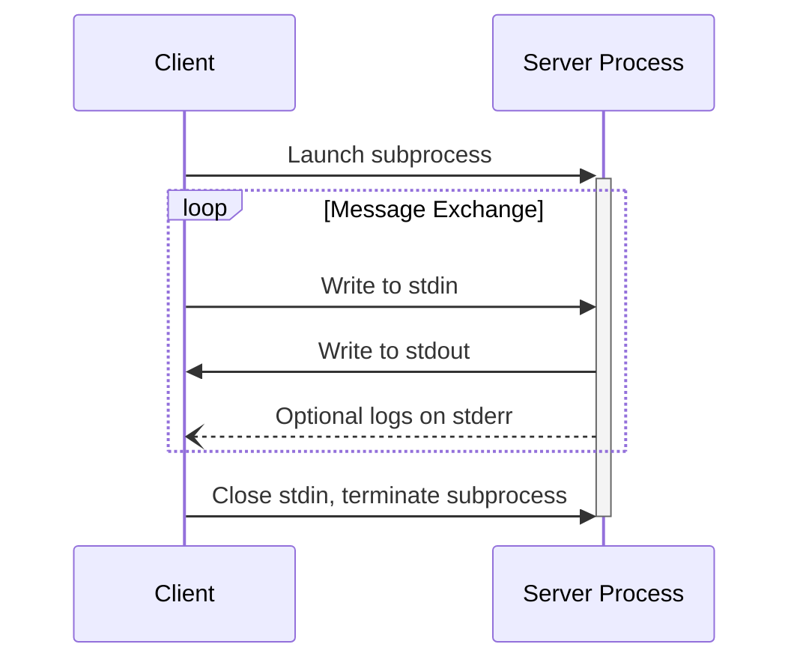
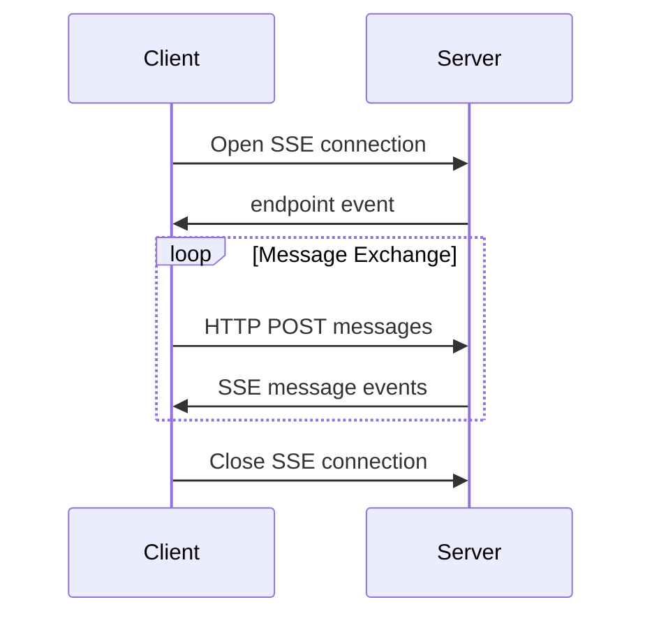

<Info>**协议修订**: 2024-11-05</Info>

MCP 目前定义了两种标准的客户端-服务器通信传输机制：

1. [stdio](#stdio)，通过标准输入和标准输出进行通信
2. [HTTP with Server-Sent Events](#http-with-sse) (SSE)

客户端**应该**尽可能支持stdio。

客户端和服务器也可以以可插拔的方式实现[自定义传输](#custom-transports)。

## stdio

在 **stdio** 传输中：

- 客户端将MCP服务器作为子进程启动。
- 服务器在其标准输入（`stdin`）上接收JSON-RPC消息，并在标准输出（`stdout`）上写入响应。
- 消息由换行符分隔，**不能**包含嵌入的换行符。
- 服务器**可以**将其标准错误（`stderr`）写入UTF-8字符串以进行日志记录。客户端**可以**捕获、转发或忽略此日志记录。
- 服务器**不能**将其 `stdout` 写入任何不是有效MCP消息的内容。
- 客户端**不能**将其 `stdin` 写入任何不是有效MCP消息的内容。

## HTTP with SSE

在 **SSE** 传输中，服务器作为独立进程运行，可以处理多个客户端连接。

#### 安全警告

实现HTTP with SSE传输时：

1. 服务器**必须**验证所有传入连接上的 `Origin` 头以防止DNS重绑定攻击
2. 在本地运行时，服务器**应该**仅绑定到localhost (127.0.0.1) 而不是所有网络接口 (0.0.0.0)
3. 服务器**应该**为所有连接实现适当的认证

如果没有这些保护，攻击者可以使用DNS重绑定从远程网站与本地MCP服务器交互。

服务器**必须**提供两个端点：

1. SSE端点，供客户端建立连接并从服务器接收消息
2. 常规HTTP POST端点，供客户端向服务器发送消息

当客户端连接时，服务器**必须**发送包含客户端用于发送消息的URI的 `endpoint` 事件。所有后续客户端消息**必须**作为HTTP POST请求发送到此端点。

服务器消息作为SSE `message` 事件发送，消息内容在事件数据中编码为JSON。

## 自定义传输

客户端和服务器**可以**实现额外的自定义传输机制以满足其特定需求。该协议与传输无关，可以在任何支持双向消息交换的通信通道上实现。

选择支持自定义传输的实现者**必须**确保它们保留MCP定义的JSON-RPC消息格式和生命周期要求。自定义传输**应该**记录其特定的连接建立和消息交换模式以帮助互操作性。
