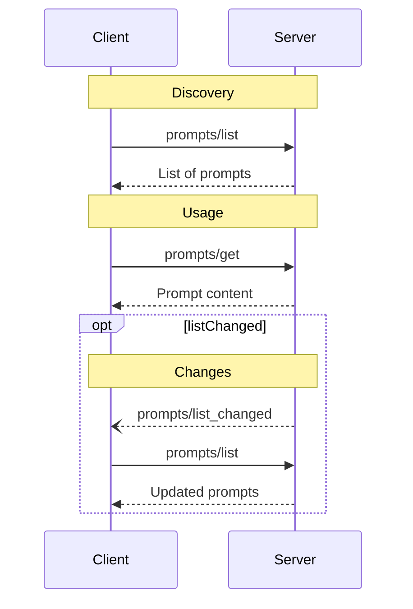

<Info>**协议修订**: 2024-11-05</Info>

Model Context Protocol (MCP) 为服务器提供了一种标准化的方式来向客户端暴露提示模板。提示允许服务器为与语言模型的交互提供结构化的消息和指令。客户端可以发现可用的提示、检索其内容，并提供参数来自定义它们。

## 用户交互模型

提示被设计为**用户控制**，这意味着它们从服务器暴露到客户端，目的是让用户能够明确选择它们用于使用。

通常，提示会通过用户界面中的用户发起的命令触发，这允许用户自然地发现和调用可用的提示。

例如，作为斜杠命令：


但是，实现者可以自由地通过任何适合其需求的界面模式来暴露提示——协议本身不强制任何特定的用户交互模型。

## 功能

支持提示的服务器**必须**在[初始化](/specification/2024-11-05/basic/lifecycle#initialization)期间声明 `prompts` 功能：

```json
{
  "capabilities": {
    "prompts": {
      "listChanged": true
    }
  }
}
```

`listChanged` 指示服务器是否会在可用提示列表更改时发出通知。

## 协议消息

### 列出提示

要检索可用的提示，客户端发送 `prompts/list` 请求。此操作支持[分页](/specification/2024-11-05/server/utilities/pagination)。

**请求：**

```json
{
  "jsonrpc": "2.0",
  "id": 1,
  "method": "prompts/list",
  "params": {
    "cursor": "optional-cursor-value"
  }
}
```

**响应：**

```json
{
  "jsonrpc": "2.0",
  "id": 1,
  "result": {
    "prompts": [
      {
        "name": "code_review",
        "description": "Asks the LLM to analyze code quality and suggest improvements",
        "arguments": [
          {
            "name": "code",
            "description": "The code to review",
            "required": true
          }
        ]
      }
    ],
    "nextCursor": "next-page-cursor"
  }
}
```

### 获取提示

要检索特定的提示，客户端发送 `prompts/get` 请求。参数可以通过[完成API](/specification/2024-11-05/server/utilities/completion)自动完成。

**请求：**

```json
{
  "jsonrpc": "2.0",
  "id": 2,
  "method": "prompts/get",
  "params": {
    "name": "code_review",
    "arguments": {
      "code": "def hello():\n    print('world')"
    }
  }
}
```

**响应：**

```json
{
  "jsonrpc": "2.0",
  "id": 2,
  "result": {
    "description": "Code review prompt",
    "messages": [
      {
        "role": "user",
        "content": {
          "type": "text",
          "text": "Please review this Python code:\ndef hello():\n    print('world')"
        }
      }
    ]
  }
}
```

### 列表更改通知

当可用提示列表更改时，声明了 `listChanged` 功能的服务器**应该**发送通知：

```json
{
  "jsonrpc": "2.0",
  "method": "notifications/prompts/list_changed"
}
```

## 消息流程



## 数据类型

### 提示

提示定义包括：

- `name`：提示的唯一标识符
- `description`：可选的人类可读描述
- `arguments`：用于自定义的可选参数列表

### PromptMessage

提示中的消息可以包含：

- `role`： "user" 或 "assistant" 以指示说话者
- `content`：以下内容类型之一：

#### 文本内容

文本内容表示纯文本消息：

```json
{
  "type": "text",
  "text": "The text content of the message"
}
```

这是用于自然语言交互的最常见内容类型。

#### 图像内容

图像内容允许在消息中包含视觉信息：

```json
{
  "type": "image",
  "data": "base64-encoded-image-data",
  "mimeType": "image/png"
}
```

图像数据**必须**是base64编码的，并包含有效的MIME类型。这启用了视觉上下文重要的多模态交互。

#### 嵌入资源

嵌入资源允许在消息中直接引用服务器端资源：

```json
{
  "type": "resource",
  "resource": {
    "uri": "resource://example",
    "mimeType": "text/plain",
    "text": "Resource content"
  }
}
```

资源可以包含文本或二进制（blob）数据，并且**必须**包含：

- 有效的资源URI
- 适当的MIME类型
- 文本内容或base64编码的blob数据

嵌入资源使提示能够无缝地将服务器管理的內容如文档、代码示例或其他参考材料直接纳入对话流程。

## 错误处理

服务器**应该**为常见失败情况返回标准JSON-RPC错误：

- 无效提示名称：`-32602`（无效参数）
- 缺少必需参数：`-32602`（无效参数）
- 内部错误：`-32603`（内部错误）

## 实现考虑

1. 服务器**应该**在处理前验证提示参数
2. 客户端**应该**处理大型提示列表的分页
3. 双方**应该**尊重功能协商

## 安全

实现**必须**仔细验证所有提示输入和输出以防止注入攻击或对资源的未经授权访问。

The Model Context Protocol (MCP) provides a standardized way for servers to expose prompt
templates to clients. Prompts allow servers to provide structured messages and
instructions for interacting with language models. Clients can discover available
prompts, retrieve their contents, and provide arguments to customize them.

## User Interaction Model

Prompts are designed to be **user-controlled**, meaning they are exposed from servers to
clients with the intention of the user being able to explicitly select them for use.

Typically, prompts would be triggered through user-initiated commands in the user
interface, which allows users to naturally discover and invoke available prompts.

For example, as slash commands:


However, implementors are free to expose prompts through any interface pattern that suits
their needs&mdash;the protocol itself does not mandate any specific user interaction
model.

## Capabilities

Servers that support prompts **MUST** declare the `prompts` capability during
[initialization](/specification/2024-11-05/basic/lifecycle#initialization):

```json
{
  "capabilities": {
    "prompts": {
      "listChanged": true
    }
  }
}
```

`listChanged` indicates whether the server will emit notifications when the list of
available prompts changes.

## Protocol Messages

### Listing Prompts

To retrieve available prompts, clients send a `prompts/list` request. This operation
supports
[pagination](/specification/2024-11-05/server/utilities/pagination).

**Request:**

```json
{
  "jsonrpc": "2.0",
  "id": 1,
  "method": "prompts/list",
  "params": {
    "cursor": "optional-cursor-value"
  }
}
```

**Response:**

```json
{
  "jsonrpc": "2.0",
  "id": 1,
  "result": {
    "prompts": [
      {
        "name": "code_review",
        "description": "Asks the LLM to analyze code quality and suggest improvements",
        "arguments": [
          {
            "name": "code",
            "description": "The code to review",
            "required": true
          }
        ]
      }
    ],
    "nextCursor": "next-page-cursor"
  }
}
```

### Getting a Prompt

To retrieve a specific prompt, clients send a `prompts/get` request. Arguments may be
auto-completed through [the completion API](/specification/2024-11-05/server/utilities/completion).

**Request:**

```json
{
  "jsonrpc": "2.0",
  "id": 2,
  "method": "prompts/get",
  "params": {
    "name": "code_review",
    "arguments": {
      "code": "def hello():\n    print('world')"
    }
  }
}
```

**Response:**

```json
{
  "jsonrpc": "2.0",
  "id": 2,
  "result": {
    "description": "Code review prompt",
    "messages": [
      {
        "role": "user",
        "content": {
          "type": "text",
          "text": "Please review this Python code:\ndef hello():\n    print('world')"
        }
      }
    ]
  }
}
```

### List Changed Notification

When the list of available prompts changes, servers that declared the `listChanged`
capability **SHOULD** send a notification:

```json
{
  "jsonrpc": "2.0",
  "method": "notifications/prompts/list_changed"
}
```

## Message Flow


## Data Types

### Prompt

A prompt definition includes:

- `name`: Unique identifier for the prompt
- `description`: Optional human-readable description
- `arguments`: Optional list of arguments for customization

### PromptMessage

Messages in a prompt can contain:

- `role`: Either "user" or "assistant" to indicate the speaker
- `content`: One of the following content types:

#### Text Content

Text content represents plain text messages:

```json
{
  "type": "text",
  "text": "The text content of the message"
}
```

This is the most common content type used for natural language interactions.

#### Image Content

Image content allows including visual information in messages:

```json
{
  "type": "image",
  "data": "base64-encoded-image-data",
  "mimeType": "image/png"
}
```

The image data **MUST** be base64-encoded and include a valid MIME type. This enables
multi-modal interactions where visual context is important.

#### Embedded Resources

Embedded resources allow referencing server-side resources directly in messages:

```json
{
  "type": "resource",
  "resource": {
    "uri": "resource://example",
    "mimeType": "text/plain",
    "text": "Resource content"
  }
}
```

Resources can contain either text or binary (blob) data and **MUST** include:

- A valid resource URI
- The appropriate MIME type
- Either text content or base64-encoded blob data

Embedded resources enable prompts to seamlessly incorporate server-managed content like
documentation, code samples, or other reference materials directly into the conversation
flow.

## Error Handling

Servers **SHOULD** return standard JSON-RPC errors for common failure cases:

- Invalid prompt name: `-32602` (Invalid params)
- Missing required arguments: `-32602` (Invalid params)
- Internal errors: `-32603` (Internal error)

## Implementation Considerations

1. Servers **SHOULD** validate prompt arguments before processing
2. Clients **SHOULD** handle pagination for large prompt lists
3. Both parties **SHOULD** respect capability negotiation

## Security

Implementations **MUST** carefully validate all prompt inputs and outputs to prevent
injection attacks or unauthorized access to resources.
