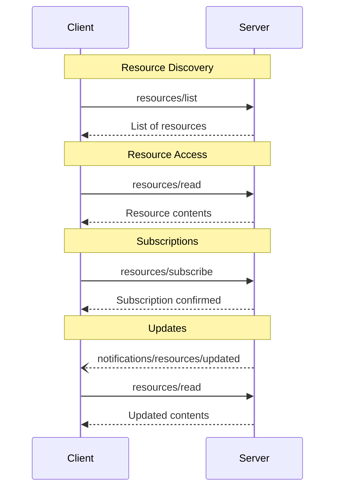

<Info>**协议修订**: 2024-11-05</Info>

Model Context Protocol (MCP) 为服务器提供了一种标准化的方式来向客户端暴露资源。资源允许服务器共享为语言模型提供上下文的数据，例如文件、数据库模式或特定于应用程序的信息。每个资源都由一个[URI](https://datatracker.ietf.org/doc/html/rfc3986)唯一标识。

## 用户交互模型

MCP中的资源被设计为**应用程序驱动**，主机应用程序根据其需求确定如何纳入上下文。

例如，应用程序可以：

- 通过UI元素暴露资源以进行显式选择，在树或列表视图中
- 允许用户搜索和过滤可用资源
- 实现自动上下文包含，基于启发式或AI模型的选择


但是，实现可以自由地通过任何适合其需求的界面模式来暴露资源——协议本身不强制任何特定的用户交互模型。

## 功能

支持资源的服务器**必须**声明 `resources` 功能：

```json
{
  "capabilities": {
    "resources": {
      "subscribe": true,
      "listChanged": true
    }
  }
}
```

该功能支持两个可选特性：

- `subscribe`：客户端是否可以订阅以接收单个资源更改的通知。
- `listChanged`：服务器是否会在可用资源列表更改时发出通知。

`subscribe` 和 `listChanged` 都是可选的——服务器可以不支持任何一个、任何一个或两个都支持：

```json
{
  "capabilities": {
    "resources": {} // 不支持任何特性
  }
}
```

```json
{
  "capabilities": {
    "resources": {
      "subscribe": true // 仅支持订阅
    }
  }
}
```

```json
{
  "capabilities": {
    "resources": {
      "listChanged": true // 仅支持列表更改通知
    }
  }
}
```

## 协议消息

### 列出资源

要发现可用资源，客户端发送 `resources/list` 请求。此操作支持[分页](/specification/2024-11-05/server/utilities/pagination)。

**请求：**

```json
{
  "jsonrpc": "2.0",
  "id": 1,
  "method": "resources/list",
  "params": {
    "cursor": "optional-cursor-value"
  }
}
```

**响应：**

```json
{
  "jsonrpc": "2.0",
  "id": 1,
  "result": {
    "resources": [
      {
        "uri": "file:///project/src/main.rs",
        "name": "main.rs",
        "description": "Primary application entry point",
        "mimeType": "text/x-rust"
      }
    ],
    "nextCursor": "next-page-cursor"
  }
}
```

### 读取资源

要检索资源内容，客户端发送 `resources/read` 请求：

**请求：**

```json
{
  "jsonrpc": "2.0",
  "id": 2,
  "method": "resources/read",
  "params": {
    "uri": "file:///project/src/main.rs"
  }
}
```

**响应：**

```json
{
  "jsonrpc": "2.0",
  "id": 2,
  "result": {
    "contents": [
      {
        "uri": "file:///project/src/main.rs",
        "mimeType": "text/x-rust",
        "text": "fn main() {\n    println!(\"Hello world!\");\n}"
      }
    ]
  }
}
```

### 资源模板

资源模板允许服务器使用[URI模板](https://datatracker.ietf.org/doc/html/rfc6570)暴露参数化资源。参数可以通过[完成API](/specification/2024-11-05/server/utilities/completion)自动完成。

**请求：**

```json
{
  "jsonrpc": "2.0",
  "id": 3,
  "method": "resources/templates/list"
}
```

**响应：**

```json
{
  "jsonrpc": "2.0",
  "id": 3,
  "result": {
    "resourceTemplates": [
      {
        "uriTemplate": "file:///{path}",
        "name": "Project Files",
        "description": "Access files in the project directory",
        "mimeType": "application/octet-stream"
      }
    ]
  }
}
```

### 列表更改通知

当可用资源列表更改时，声明了 `listChanged` 功能的服务器**应该**发送通知：

```json
{
  "jsonrpc": "2.0",
  "method": "notifications/resources/list_changed"
}
```

### 订阅

协议支持可选的资源更改订阅。客户端可以订阅特定资源，并在它们更改时接收通知：

**订阅请求：**

```json
{
  "jsonrpc": "2.0",
  "id": 4,
  "method": "resources/subscribe",
  "params": {
    "uri": "file:///project/src/main.rs"
  }
}
```

**更新通知：**

```json
{
  "jsonrpc": "2.0",
  "method": "notifications/resources/updated",
  "params": {
    "uri": "file:///project/src/main.rs"
  }
}
```

## 消息流程



## 数据类型

### 资源

资源定义包括：

- `uri`：资源的唯一标识符
- `name`：人类可读名称
- `description`：可选描述
- `mimeType`：可选MIME类型

### 资源内容

资源可以包含文本或二进制数据：

#### 文本内容

```json
{
  "uri": "file:///example.txt",
  "mimeType": "text/plain",
  "text": "Resource content"
}
```

#### 二进制内容

```json
{
  "uri": "file:///example.png",
  "mimeType": "image/png",
  "blob": "base64-encoded-data"
}
```

## 常见URI方案

协议定义了几个标准URI方案。这个列表不是详尽的——实现总是可以自由使用额外的自定义URI方案。

### https://

用于表示网上可用的资源。

服务器**应该**仅在客户端能够自行从网上获取和加载资源时使用此方案——也就是说，它不需要通过MCP服务器读取资源。

对于其他用例，服务器**应该**更喜欢使用另一个URI方案，或定义一个自定义的，即使服务器本身将通过互联网下载资源内容。

### file://

用于标识行为像文件系统的资源。但是，资源不需要映射到实际的物理文件系统。

MCP服务器**可以**使用[XDG MIME类型](https://specifications.freedesktop.org/shared-mime-info-spec/0.14/ar01s02.html#id-1.3.14)，如 `inode/directory`，来标识file://资源，以表示没有标准MIME类型的非常规文件（如目录）。

### git://

Git版本控制集成。

## 错误处理

服务器**应该**为常见失败情况返回标准JSON-RPC错误：

- 资源未找到：`-32002`
- 内部错误：`-32603`

错误示例：

```json
{
  "jsonrpc": "2.0",
  "id": 5,
  "error": {
    "code": -32002,
    "message": "Resource not found",
    "data": {
      "uri": "file:///nonexistent.txt"
    }
  }
}
```

## 安全考虑

1. 服务器**必须**验证所有资源URI
2. 访问控制**应该**为敏感资源实现
3. 二进制数据**必须**正确编码
4. 资源权限**应该**在操作前检查
