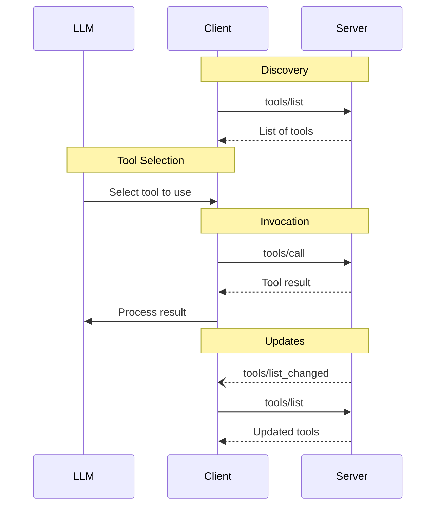

<Info>**协议修订**: 2024-11-05</Info>

Model Context Protocol (MCP) 允许服务器暴露可以由语言模型调用的工具。工具使模型能够与外部系统交互，例如查询数据库、调用API或执行计算。每个工具都由名称唯一标识，并包含描述其模式的元数据。

## 用户交互模型

MCP中的工具被设计为**模型控制**，这意味着语言模型可以基于其上下文理解和用户的提示自动发现和调用工具。

但是，实现可以自由地通过任何适合其需求的界面模式来暴露工具——协议本身不强制任何特定的用户交互模型。

<Warning>

为了信任、安全和安全性，**应该**始终有人在回路中，能够拒绝工具调用。

应用程序**应该**：

- 提供使清楚哪些工具被暴露给AI模型的UI
- 在工具被调用时插入清晰的视觉指示器
- 为操作呈现确认提示给用户，以确保有人在回路中

</Warning>

## 功能

支持工具的服务器**必须**声明 `tools` 功能：

```json
{
  "capabilities": {
    "tools": {
      "listChanged": true
    }
  }
}
```

`listChanged` 指示服务器是否会在可用工具列表更改时发出通知。

## 协议消息

### 列出工具

要发现可用工具，客户端发送 `tools/list` 请求。此操作支持[分页](/specification/2024-11-05/server/utilities/pagination)。

**请求：**

```json
{
  "jsonrpc": "2.0",
  "id": 1,
  "method": "tools/list",
  "params": {
    "cursor": "optional-cursor-value"
  }
}
```

**响应：**

```json
{
  "jsonrpc": "2.0",
  "id": 1,
  "result": {
    "tools": [
      {
        "name": "get_weather",
        "description": "Get current weather information for a location",
        "inputSchema": {
          "type": "object",
          "properties": {
            "location": {
              "type": "string",
              "description": "City name or zip code"
            }
          },
          "required": ["location"]
        }
      }
    ],
    "nextCursor": "next-page-cursor"
  }
}
```

### 调用工具

要调用工具，客户端发送 `tools/call` 请求：

**请求：**

```json
{
  "jsonrpc": "2.0",
  "id": 2,
  "method": "tools/call",
  "params": {
    "name": "get_weather",
    "arguments": {
      "location": "New York"
    }
  }
}
```

**响应：**

```json
{
  "jsonrpc": "2.0",
  "id": 2,
  "result": {
    "content": [
      {
        "type": "text",
        "text": "Current weather in New York:\nTemperature: 72°F\nConditions: Partly cloudy"
      }
    ],
    "isError": false
  }
}
```

### 列表更改通知

当可用工具列表更改时，声明了 `listChanged` 功能的服务器**应该**发送通知：

```json
{
  "jsonrpc": "2.0",
  "method": "notifications/tools/list_changed"
}
```

## 消息流程



## 数据类型

### 工具

工具定义包括：

- `name`：工具的唯一标识符
- `description`：功能的人类可读描述
- `inputSchema`：定义预期参数的JSON Schema

### 工具结果

工具结果可以包含不同类型的多个内容项：

#### 文本内容

```json
{
  "type": "text",
  "text": "Tool result text"
}
```

#### 图像内容

```json
{
  "type": "image",
  "data": "base64-encoded-data",
  "mimeType": "image/png"
}
```

#### 嵌入资源

[资源](/specification/2024-11-05/server/resources)**可以**被嵌入，以提供额外的上下文或数据，在客户端稍后可以订阅或再次获取的URI后面：

```json
{
  "type": "resource",
  "resource": {
    "uri": "resource://example",
    "mimeType": "text/plain",
    "text": "Resource content"
  }
}
```

## 错误处理

工具使用两种错误报告机制：

1. **协议错误**：标准JSON-RPC错误，用于如下问题：
   - 未知工具
   - 无效参数
   - 服务器错误

2. **工具执行错误**：在工具结果中报告，带有 `isError: true`：
   - API失败
   - 无效输入数据
   - 业务逻辑错误

协议错误示例：

```json
{
  "jsonrpc": "2.0",
  "id": 3,
  "error": {
    "code": -32602,
    "message": "Unknown tool: invalid_tool_name"
  }
}
```

工具执行错误示例：

```json
{
  "jsonrpc": "2.0",
  "id": 4,
  "result": {
    "content": [
      {
        "type": "text",
        "text": "Failed to fetch weather data: API rate limit exceeded"
      }
    ],
    "isError": true
  }
}
```

## 安全考虑

1. 服务器**必须**：
   - 验证所有工具输入
   - 实现适当的访问控制
   - 对工具调用进行速率限制
   - 清理工具输出

2. 客户端**应该**：
   - 对敏感操作提示用户确认
   - 在调用服务器之前向用户显示工具输入，以避免恶意或意外的数据泄露
   - 在传递给LLM之前验证工具结果
   - 为工具调用实现超时
   - 为审计目的记录工具使用情况
