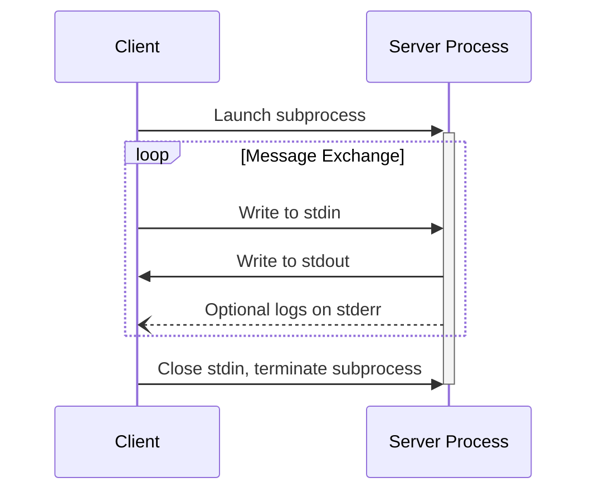
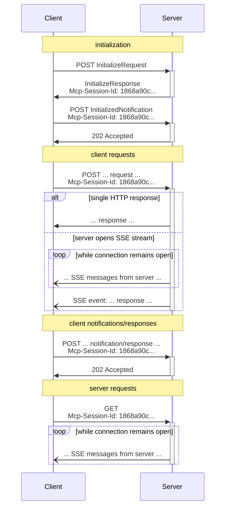

<Info>**协议修订**: 2025-03-26</Info>

MCP使用JSON-RPC对消息进行编码。JSON-RPC消息**必须**是UTF-8编码的。

该协议目前为客户端-服务器通信定义了两种标准传输机制：

1. [stdio](#stdio)，通过标准输入和标准输出进行通信
2. [Streamable HTTP](#streamable-http)

客户端**应该**尽可能支持stdio。

客户端和服务器也可以以可插拔的方式实现[自定义传输](#custom-transports)。

## stdio

在**stdio**传输中：

- 客户端将MCP服务器作为子进程启动。
- 服务器从其标准输入（`stdin`）读取JSON-RPC消息，并将消息发送到其标准输出（`stdout`）。
- 消息可以是JSON-RPC请求、通知、响应——或者包含一个或多个请求和/或通知的JSON-RPC[批处理](https://www.jsonrpc.org/specification#batch)。
- 消息由换行符分隔，并且**不能**包含嵌入的换行符。
- 服务器**可以**为其标准错误（`stderr`）写入UTF-8字符串以用于日志记录目的。客户端**可以**捕获、转发或忽略此日志记录。
- 服务器**不能**将其不是有效MCP消息的任何内容写入其`stdout`。
- 客户端**不能**将其不是有效MCP消息的任何内容写入服务器的`stdin`。

## Streamable HTTP

<Info>

This replaces the [HTTP+SSE
transport](/specification/2024-11-05/basic/transports#http-with-sse) from
protocol version 2024-11-05. See the [backwards compatibility](#backwards-compatibility)
guide below.

</Info>

在**Streamable HTTP**传输中，服务器作为独立进程运行，可以处理多个客户端连接。此传输使用HTTP POST和GET请求。服务器可以选择使用[Server-Sent Events](https://en.wikipedia.org/wiki/Server-sent_events) (SSE)来流式传输多个服务器消息。这允许基本的MCP服务器，以及支持流式传输和服务器到客户端通知和请求的更丰富的服务器。

服务器**必须**提供支持POST和GET方法的单个HTTP端点路径（以下简称**MCP端点**）。例如，这可以是像`https://example.com/mcp`这样的URL。

#### 安全警告

实施Streamable HTTP传输时：

1. 服务器**必须**验证所有传入连接上的`Origin`头以防止DNS重新绑定攻击
2. 在本地运行时，服务器**应该**仅绑定到localhost (127.0.0.1)而不是所有网络接口(0.0.0.0)
3. 服务器**应该**为所有连接实施适当的认证

如果没有这些保护，攻击者可以使用DNS重新绑定从远程网站与本地MCP服务器交互。

### 向服务器发送消息

从客户端发送的每个JSON-RPC消息**必须**是对MCP端点的新HTTP POST请求。

1. 客户端**必须**使用HTTP POST将JSON-RPC消息发送到MCP端点。
2. 客户端**必须**包含`Accept`头，列出`application/json`和`text/event-stream`作为支持的内容类型。
3. POST请求的主体**必须**是以下之一：
   - 单个JSON-RPC _请求_、_通知_或_响应_
   - 数组[批处理](https://www.jsonrpc.org/specification#batch)一个或多个_requests和/或通知_
   - 数组[批处理](https://www.jsonrpc.org/specification#batch)一个或多个_responses_
4. 如果输入仅由（任何数量的）JSON-RPC _响应_或_notifications_组成：
   - 如果服务器接受输入，服务器**必须**返回HTTP状态码202 Accepted且无主体。
   - 如果服务器无法接受输入，它**必须**返回HTTP错误状态码（例如400 Bad Request）。HTTP响应主体**可以**包含没有`id`的JSON-RPC _错误响应_。
5. 如果输入包含任何数量的JSON-RPC _请求_，服务器**必须**返回`Content-Type: text/event-stream`以启动SSE流，或`Content-Type: application/json`以返回一个JSON对象。客户端**必须**
   support both these cases.
6. If the server initiates an SSE stream:
   - The SSE stream **SHOULD** eventually include one JSON-RPC _response_ per each
     JSON-RPC _request_ sent in the POST body. These _responses_ **MAY** be
     [batched](https://www.jsonrpc.org/specification#batch).
   - The server **MAY** send JSON-RPC _requests_ and _notifications_ before sending a
     JSON-RPC _response_. These messages **SHOULD** relate to the originating client
     _request_. These _requests_ and _notifications_ **MAY** be
     [batched](https://www.jsonrpc.org/specification#batch).
   - The server **SHOULD NOT** close the SSE stream before sending a JSON-RPC _response_
     per each received JSON-RPC _request_, unless the [session](#session-management)
     expires.
   - After all JSON-RPC _responses_ have been sent, the server **SHOULD** close the SSE
     stream.
   - Disconnection **MAY** occur at any time (e.g., due to network conditions).
     Therefore:
     - 断开连接**不应该**被解释为客户端取消其请求。
     - 要取消，客户端**应该**明确发送MCP `CancelledNotification`。
     - 为避免由于断开连接而丢失消息，服务器**可以**使流[可恢复](#resumability-and-redelivery)。

### 监听来自服务器的消息

1. 客户端**可以**向MCP端点发出HTTP GET。这可以用于打开SSE流，允许服务器与客户端通信，而客户端首先不通过HTTP POST发送数据。
2. 客户端**必须**包含`Accept`头，将`text/event-stream`列为支持的内容类型。
3. 服务器**必须**返回`Content-Type: text/event-stream`以响应此HTTP GET，或者返回HTTP 405 Method Not Allowed，表示服务器在此端点不提供SSE流。
4. 如果服务器启动SSE流：
   - 服务器**可以**在流上发送JSON-RPC _请求_和_通知_。这些_requests_和_notifications_**可以**[批处理](https://www.jsonrpc.org/specification#batch)。
   - 这些消息**应该**与客户端的任何并发运行的JSON-RPC _request_无关。
   - 服务器**不能**在流上发送JSON-RPC _response_ **除非**[恢复](#resumability-and-redelivery)与之前客户端请求关联的流。
   - 服务器**可以**随时关闭SSE流。
   - 客户端**可以**随时关闭SSE流。

### 多个连接

1. 客户端**可以**同时保持连接到多个SSE流。
2. 服务器**必须**仅在一个连接的流上发送其每个JSON-RPC消息；也就是说，它**不能**跨多个流广播相同消息。
   - 消息丢失的风险**可以**通过使流[可恢复](#resumability-and-redelivery)来缓解。

### 可恢复性和重新传递

为了支持恢复断开的连接，并重新传递可能丢失的消息：

1. 服务器**可以**为其SSE事件附加`id`字段，如[SSE标准](https://html.spec.whatwg.org/multipage/server-sent-events.html#event-stream-interpretation)中所述。
   - 如果存在，ID**必须**在该[会话](#session-management)内的所有流中全局唯一——或者如果未使用会话管理，则在该特定客户端的所有流中全局唯一。
2. 如果客户端希望在断开连接后恢复，它**应该**向MCP端点发出HTTP GET，并包含[`Last-Event-ID`](https://html.spec.whatwg.org/multipage/server-sent-events.html#the-last-event-id-header)头以指示它收到的最后一个事件ID。
   - 服务器**可以**使用此头来重放将在最后一个事件ID之后发送的消息，_在断开的流上_，并恢复
     stream from that point.
   - The server **MUST NOT** replay messages that would have been delivered on a
     different stream.

In other words, these event IDs should be assigned by servers on a _per-stream_ basis, to
act as a cursor within that particular stream.

### Session Management

An MCP "session" consists of logically related interactions between a client and a
server, beginning with the [initialization phase](/specification/2025-03-26/basic/lifecycle). To support
servers which want to establish stateful sessions:

1. A server using the Streamable HTTP transport **MAY** assign a session ID at
   initialization time, by including it in an `Mcp-Session-Id` header on the HTTP
   response containing the `InitializeResult`.
   - The session ID **SHOULD** be globally unique and cryptographically secure (e.g., a
     securely generated UUID, a JWT, or a cryptographic hash).
   - The session ID **MUST** only contain visible ASCII characters (ranging from 0x21 to
     0x7E).
2. 如果服务器在初始化期间返回`Mcp-Session-Id`，使用Streamable HTTP传输的客户端**必须**在所有后续HTTP请求中包含`Mcp-Session-Id`头。
   - 需要会话ID的服务器**应该**对不包含`Mcp-Session-Id`头的请求（初始化除外）以HTTP 400 Bad Request响应。
3. 服务器**可以**随时终止会话，此后它**必须**对包含该会话ID的请求以HTTP 404 Not Found响应。
4. 当客户端收到对包含`Mcp-Session-Id`的请求的HTTP 404响应时，它**必须**通过发送不附加会话ID的新`InitializeRequest`来启动新会话。
5. 不再需要特定会话的客户端（例如，因为用户正在离开客户端应用程序）**应该**使用`Mcp-Session-Id`头向MCP端点发送HTTP DELETE，以明确终止会话。
   - 服务器**可以**对此请求以HTTP 405 Method Not Allowed响应，表示服务器不允许客户端终止会话。

### 时序图

### 向后兼容性

客户端和服务器可以通过以下方式保持与已弃用的[HTTP+SSE传输](/specification/2024-11-05/basic/transports#http-with-sse)（来自协议版本2024-11-05）的向后兼容性：

**想要支持旧客户端的服务器应该：**

- 继续托管旧传输的SSE和POST端点，以及为Streamable HTTP传输定义的新"MCP端点"。
  - 也可以组合旧的POST端点和新的MCP端点，但这可能会引入不必要的复杂性。

**想要支持旧服务器的客户端应该：**

1. 从用户接受MCP服务器URL，该URL可能指向使用旧传输或新传输的服务器。
2. 尝试使用上面定义的`Accept`头向服务器URL POST `InitializeRequest`：
   - 如果成功，客户端可以假设这是一个支持新Streamable HTTP传输的服务器。
   - 如果它以HTTP 4xx状态码失败（例如405 Method Not Allowed或404 Not Found）：
     - 向服务器URL发出GET请求，期望这将打开SSE流并返回`endpoint`事件作为第一个事件。
     - 当`endpoint`事件到达时，客户端可以假设这是一个运行旧HTTP+SSE传输的服务器，并应该为所有后续通信使用该传输。

## 自定义传输

客户端和服务器**可以**实施额外的自定义传输机制以满足其特定需求。该协议是传输不可知的，可以在支持双向消息交换的任何通信通道上实施。

选择支持自定义传输的实施者**必须**确保它们保留MCP定义的JSON-RPC消息格式和生命周期要求。自定义传输**应该**记录其特定的连接建立和消息交换模式，以帮助互操作性。
