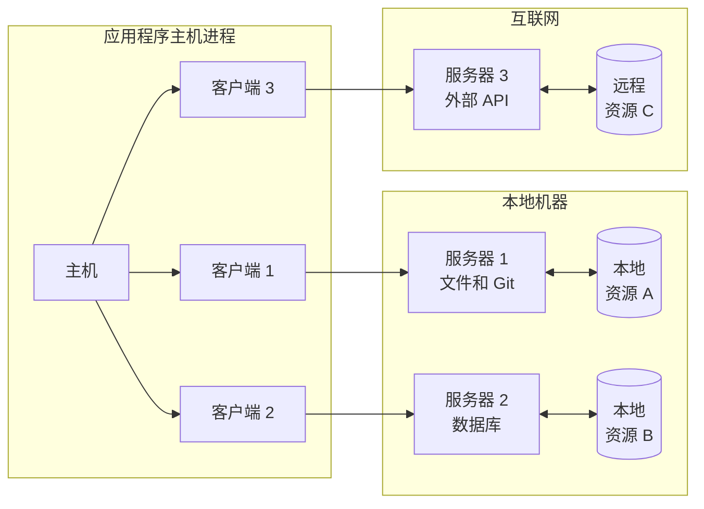
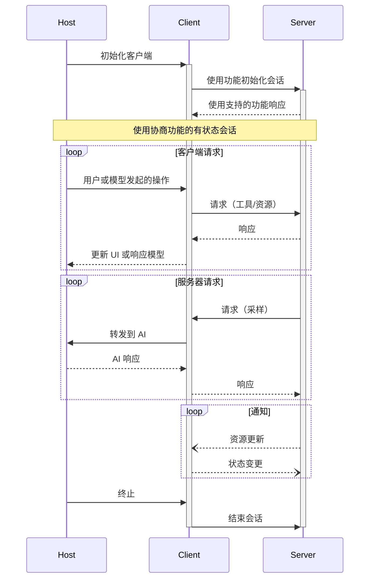

模型上下文协议 (MCP) 遵循客户端-主机-服务器架构，其中每个主机可以运行多个客户端实例。这种架构使用户能够在应用程序中集成 AI 功能，同时保持清晰的安全边界并隔离关注点。基于 JSON-RPC 构建的 MCP 提供了一个有状态的会话协议，专注于客户端和服务器之间的上下文交换和采样协调。

## 核心组件

### 主机

主机进程充当容器和协调器：

- 创建和管理多个客户端实例
- 控制客户端连接权限和生命周期
- 实施安全策略和同意要求
- 处理用户授权决策
- 协调 AI/LLM 集成和采样
- 管理跨客户端的上下文聚合

### 客户端

每个客户端由主机创建并维护与服务器的隔离连接：

- 为每个服务器建立一个有状态会话
- 处理协议协商和功能交换
- 双向路由协议消息
- 管理订阅和通知
- 在服务器之间维护安全边界

主机应用程序创建并管理多个客户端，每个客户端与特定服务器具有 1:1 的关系。

### 服务器

服务器提供专门的上下文和功能：

- 通过 MCP 原语暴露资源、工具和提示
- 以独立的、专注的责任运行
- 通过客户端接口请求采样
- 必须遵守安全约束
- 可以是本地进程或远程服务

## 设计原则

MCP 基于几个关键设计原则构建，这些原则为其架构和实现提供信息：

1. **服务器应该非常容易构建**
   - 主机应用程序处理复杂的编排责任
   - 服务器专注于特定的、定义明确的功能
   - 简单接口最小化实现开销
   - 清晰分离实现可维护代码

2. **服务器应该高度可组合**
   - 每个服务器以隔离方式提供专注功能
   - 多个服务器可以无缝组合
   - 共享协议实现互操作性
   - 模块化设计支持可扩展性

3. **服务器不应该能够读取整个对话，也不能"看到"其他服务器**
   - 服务器仅接收必要的上下文信息
   - 完整对话历史保留在主机中
   - 每个服务器连接保持隔离
   - 跨服务器交互由主机控制
   - 主机进程实施安全边界

4. **功能可以逐步添加到服务器和客户端**
   - 核心协议提供最小的必需功能
   - 根据需要可以协商额外功能
   - 服务器和客户端独立演进
   - 协议设计用于未来可扩展性
   - 保持向后兼容性

## 功能协商

模型上下文协议使用基于功能的协商系统，客户端和服务器在初始化期间明确声明其支持的功能。功能确定会话期间哪些协议功能和原语可用。

- 服务器声明如资源订阅、工具支持和提示模板等功能
- 客户端声明如采样支持和通知处理等功能
- 会话期间双方必须遵守声明的功能
- 通过协议扩展可以协商额外功能

每个功能解锁会话期间使用的特定协议功能。例如：

- 实现的[服务器功能](/specification/2025-06-18/server)必须在服务器的功能中公布
- 发出资源订阅通知需要服务器声明订阅支持
- 工具调用需要服务器声明工具功能
- [采样](/specification/2025-06-18/client)需要客户端在其功能中声明支持

这种功能协商确保客户端和服务器对支持的功能有清晰理解，同时保持协议的可扩展性。
