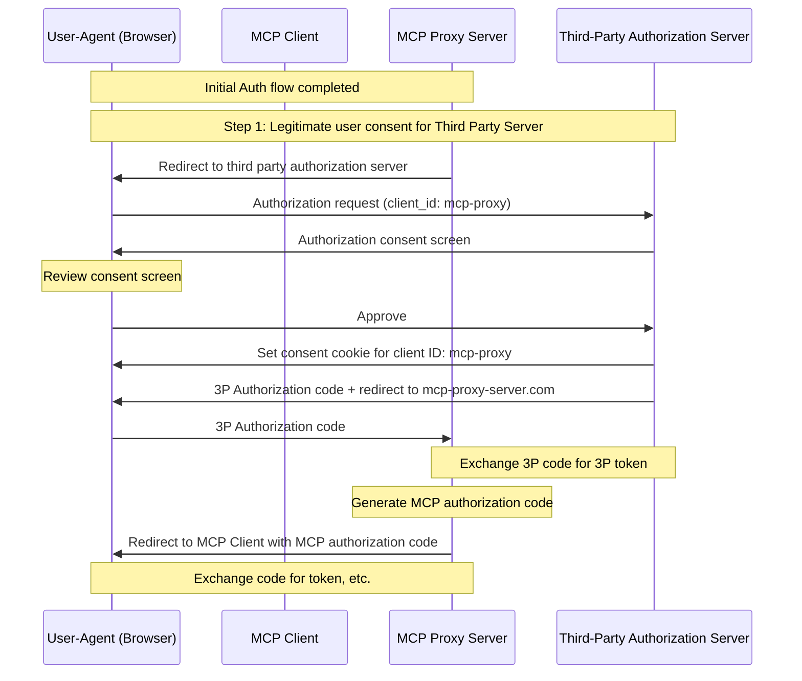
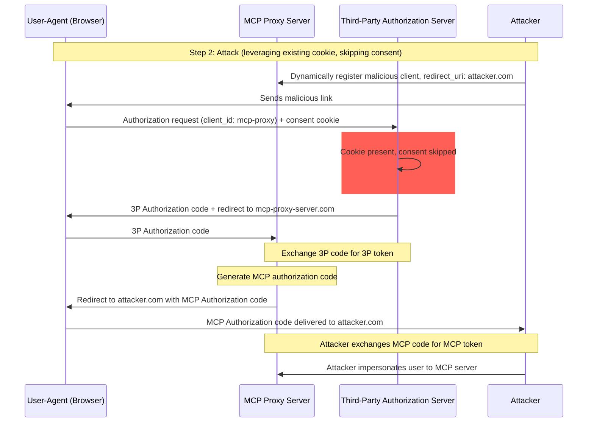
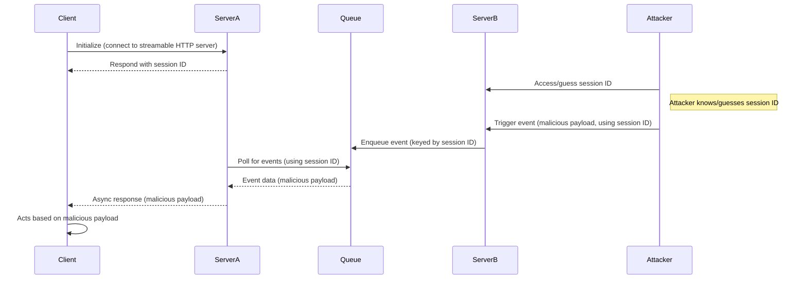
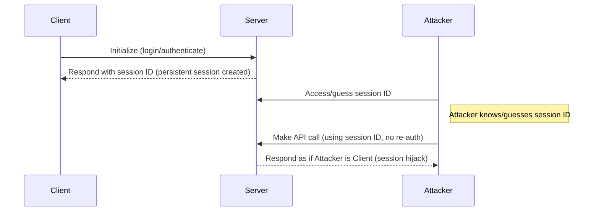

## 介绍

### 目的和范围

本文档提供了模型上下文协议 (MCP) 的安全考虑，补充了 MCP 授权规范。本文档识别了特定于 MCP 实现的 security 风险、攻击向量和最佳实践。

本文档的主要受众包括实施 MCP 授权流程的开发者、MCP 服务器操作员以及评估基于 MCP 的系统的安全专业人员。本文档应与 MCP 授权规范和 [OAuth 2.0 安全最佳实践](https://datatracker.ietf.org/doc/html/rfc9700) 一起阅读。

## 攻击和缓解措施

本节详细描述了对 MCP 实现的攻击，以及潜在的 countermeasures。

### 混淆代理问题

攻击者可以利用代理其他资源服务器的 MCP 服务器，创建 "[混淆代理](https://en.wikipedia.org/wiki/Confused_deputy_problem)" 漏洞。

#### 术语

**MCP 代理服务器**
: 一个 MCP 服务器，它将 MCP 客户端连接到第三方 API，提供 MCP 功能同时委托操作，并充当第三方 API 服务器的单个 OAuth 客户端。

**第三方授权服务器**
: 保护第三方 API 的授权服务器。它可能不支持动态客户端注册，要求 MCP 代理为所有请求使用静态客户端 ID。

**第三方 API**
: 提供实际 API 功能的受保护资源服务器。访问此 API 需要第三方授权服务器颁发的令牌。

**静态客户端 ID**
: MCP 代理服务器与第三方授权服务器通信时使用的固定 OAuth 2.0 客户端标识符。此客户端 ID 指的是充当第三方 API 客户端的 MCP 服务器。它对于所有 MCP 服务器到第三方 API 交互都是相同的值，无论哪个 MCP 客户端发起请求。

#### 架构和攻击流程

##### 正常 OAuth 代理使用（保留用户同意）

##### 恶意 OAuth 代理使用（跳过用户同意）

#### 攻击描述

当 MCP 代理服务器使用静态客户端 ID 与不支持动态客户端注册的第三方授权服务器进行身份验证时，以下攻击成为可能：

1. 用户正常通过 MCP 代理服务器进行身份验证以访问第三方 API
2. 在此流程中，第三方授权服务器在用户代理上设置一个 cookie，表示同意静态客户端 ID
3. 攻击者后来向用户发送一个恶意链接，其中包含一个精心制作的授权请求，该请求包含恶意重定向 URI 和新的动态注册客户端 ID
4. 当用户点击链接时，他们的浏览器仍然有来自先前合法请求的同意 cookie
5. 第三方授权服务器检测到 cookie 并跳过同意屏幕
6. MCP 授权码被重定向到攻击者的服务器（在动态客户端注册期间在精心制作的 redirect_uri 中指定）
7. 攻击者将窃取的授权码兑换为 MCP 服务器的访问令牌，而无需用户的明确批准
8. 攻击者现在可以作为受损用户访问第三方 API

#### 缓解措施

使用静态客户端 ID 的 MCP 代理服务器**必须**在转发到第三方授权服务器之前为每个动态注册的客户端获得用户同意（这可能需要额外同意）。

### 令牌传递

"令牌传递" 是一种反模式，其中 MCP 服务器接受来自 MCP 客户端的令牌，而不验证令牌是否正确颁发_给 MCP 服务器_，并"传递它们"到下游 API。

#### 风险

令牌传递在 [授权规范](/specification/2025-06-18/basic/authorization) 中被明确禁止，因为它引入了许多安全风险，包括：

- **安全控制规避**
  - MCP 服务器或下游 API 可能实施重要的安全控制，如速率限制、请求验证或流量监控，这些控制依赖于令牌受众或其他凭据约束。如果客户端可以获得令牌并直接与下游 API 一起使用，而 MCP 服务器没有正确验证它们或确保令牌是为正确服务颁发的，他们就会绕过这些控制。
- **问责制和审计跟踪问题**
  - 当客户端使用上游颁发的访问令牌（可能对 MCP 服务器不透明）调用时，MCP 服务器将无法识别或区分 MCP 客户端。
  - 下游资源服务器的日志可能显示似乎来自不同来源的请求，具有不同的身份，而不是实际转发令牌的 MCP 服务器。
  - 这两个因素使事件调查、控制和审计变得更加困难。
  - 如果 MCP 服务器在不验证其声明（例如角色、权限或受众）或其他元数据的情况下传递令牌，拥有被盗令牌的恶意行为者可以使用服务器作为数据泄露的代理。
- **信任边界问题**
  - 下游资源服务器向特定实体授予信任。此信任可能包括关于来源或客户端行为模式的假设。打破此信任边界可能导致意外问题。
  - 如果令牌被多个服务接受而没有适当验证，危害一个服务的攻击者可以使用令牌访问其他连接的服务。
- **未来兼容性风险**
  - 即使 MCP 服务器今天从"纯代理"开始，它可能稍后需要添加安全控制。从正确的令牌受众分离开始，可以更容易地发展安全模型。

#### 缓解措施

MCP 服务器**不得**接受任何未明确为 MCP 服务器颁发的令牌。

### 会话劫持

会话劫持是一种攻击向量，其中服务器为客户端提供会话 ID，未经授权方能够获得并使用相同的会话 ID 来冒充原始客户端并代表他们执行未经授权的操作。

#### 会话劫持提示注入

#### Session Hijack Impersonation

#### 攻击描述

当您有多个处理 MCP 请求的有状态 HTTP 服务器时，以下攻击向量成为可能：

**会话劫持提示注入**

1. 客户端连接到**服务器 A** 并接收会话 ID。
1. 攻击者获得现有会话 ID 并使用该会话 ID 向**服务器 B** 发送恶意事件。
   - 当服务器支持 [重新传递/可恢复流](/specification/2025-06-18/basic/transports#resumability-and-redelivery) 时，在接收响应之前故意终止请求可能导致它通过服务器发送事件的 GET 请求被原始客户端恢复。
   - 如果特定服务器作为工具调用的后果启动服务器发送事件，例如 `notifications/tools/list_changed`，其中可以影响服务器提供的工具，客户端最终可能拥有他们不知道已启用的工具。

1. **服务器 B** 将事件（与会话 ID 关联）排入共享队列。
1. **服务器 A** 使用会话 ID 轮询队列的事件并检索恶意负载。
1. **服务器 A** 将恶意负载作为异步或恢复响应发送给客户端。
1. 客户端接收并根据恶意负载采取行动，导致潜在危害。

**会话劫持冒充**

1. MCP 客户端与 MCP 服务器进行身份验证，创建持久会话 ID。
2. 攻击者获得会话 ID。
3. 攻击者使用会话 ID 向 MCP 服务器发出调用。
4. MCP 服务器不检查额外授权并将攻击者视为合法用户，允许未经授权的访问或操作。

#### 缓解措施

为了防止会话劫持和事件注入攻击，应实施以下缓解措施：

实施授权的 MCP 服务器**必须**验证所有入站请求。
MCP 服务器**不得**使用会话进行身份验证。

MCP 服务器**必须**使用安全、非确定性的会话 ID。
生成的会话 ID（例如 UUID）**应该**使用安全随机数生成器。避免可预测或顺序的会话标识符，这些标识符可能被攻击者猜测。轮换或使会话 ID 到期也可以降低风险。

MCP 服务器**应该**将会话 ID 绑定到用户特定信息。
在存储或传输会话相关数据时（例如在队列中），将会话 ID 与授权用户的唯一信息（如其内部用户 ID）组合。使用像 `<user_id>:<session_id>` 这样的键格式。这确保即使攻击者猜测了会话 ID，他们也无法冒充其他用户，因为用户 ID 派生自用户令牌而不是由客户端提供。

MCP 服务器可以选择利用额外的唯一标识符。
