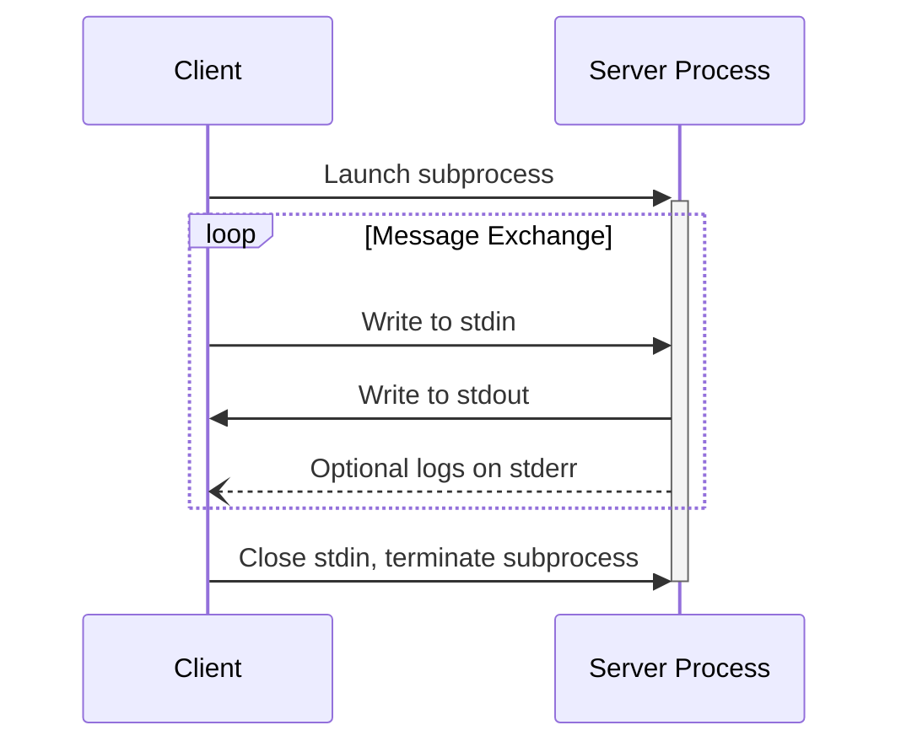
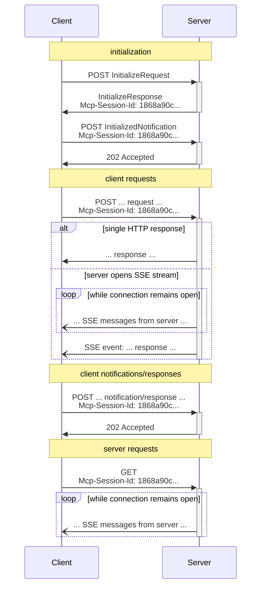

<Info>**协议修订版**：2025-06-18</Info>

MCP 使用 JSON-RPC 对消息进行编码。JSON-RPC 消息**必须**是 UTF-8 编码的。

该协议目前定义了两种标准的客户端-服务器通信传输机制：

1. [stdio](#stdio)，通过标准输入和标准输出进行通信
2. [Streamable HTTP](#streamable-http)

客户端**应该**尽可能支持 stdio。

客户端和服务器也可以以可插拔的方式实现 [自定义传输](#custom-transports)。

## stdio

在**stdio**传输中：

- 客户端将 MCP 服务器作为子进程启动。
- 服务器从其标准输入（`stdin`）读取 JSON-RPC 消息，并向其标准输出（`stdout`）发送消息。
- 消息是单个 JSON-RPC 请求、通知或响应。
- 消息由换行符分隔，并且**不得**包含嵌入的换行符。
- 服务器**可以**为其标准错误（`stderr`）写入 UTF-8 字符串以进行日志记录。客户端**可以**捕获、转发或忽略此日志记录。
- 服务器**不得**为其 `stdout` 写入任何不是有效 MCP 消息的内容。
- 客户端**不得**为其服务器的 `stdin` 写入任何不是有效 MCP 消息的内容。

## Streamable HTTP

<Info>

这替换了协议版本 2024-11-05 的 [HTTP+SSE 传输](/specification/2024-11-05/basic/transports#http-with-sse)。请参阅下面的 [向后兼容性](#backwards-compatibility) 指南。

</Info>

在**Streamable HTTP**传输中，服务器作为可以处理多个客户端连接的独立进程运行。此传输使用 HTTP POST 和 GET 请求。服务器可以选择使用 [服务器发送事件](https://en.wikipedia.org/wiki/Server-sent_events) (SSE) 来流式传输多个服务器消息。这允许基本的 MCP 服务器，以及支持流式传输和服务器到客户端通知和请求的更丰富的服务器。

服务器**必须**提供支持 POST 和 GET 方法的单个 HTTP 端点路径（以下简称**MCP 端点**）。例如，这可以是像 `https://example.com/mcp` 这样的 URL。

#### 安全警告

实施 Streamable HTTP 传输时：

1. 服务器**必须**验证所有传入连接上的 `Origin` 头以防止 DNS 重新绑定攻击
2. 在本地运行时，服务器**应该**仅绑定到 localhost (127.0.0.1) 而不是所有网络接口 (0.0.0.0)
3. 服务器**应该**为所有连接实施适当的身份验证

如果没有这些保护，攻击者可以使用 DNS 重新绑定从远程网站与本地 MCP 服务器交互。

### 向服务器发送消息

从客户端发送的每个 JSON-RPC 消息**必须**是对 MCP 端点的新 HTTP POST 请求。

1. 客户端**必须**使用 HTTP POST 将 JSON-RPC 消息发送到 MCP 端点。
2. 客户端**必须**包含一个 `Accept` 头，列出 `application/json` 和 `text/event-stream` 作为支持的内容类型。
3. POST 请求的主体**必须**是单个 JSON-RPC _请求_、_通知_ 或 _响应_。
4. 如果输入是 JSON-RPC _响应_ 或 _通知_：
   - 如果服务器接受输入，服务器**必须**返回 HTTP 状态码 202 Accepted 且无主体。
   - 如果服务器无法接受输入，它**必须**返回 HTTP 错误状态码（例如 400 Bad Request）。HTTP 响应主体**可以**包含没有 `id` 的 JSON-RPC _错误响应_。
5. 如果输入是 JSON-RPC _请求_，服务器**必须**返回 `Content-Type: text/event-stream` 以启动 SSE 流，或返回 `Content-Type: application/json` 以返回一个 JSON 对象。客户端**必须**支持这两种情况。
6. 如果服务器启动 SSE 流：
   - SSE 流**应该**最终包含为 POST 主体中发送的 JSON-RPC _请求_ 的 JSON-RPC _响应_。
   - 服务器**可以**在发送 JSON-RPC _响应_ 之前发送 JSON-RPC _请求_ 和 _通知_。这些消息**应该**与原始客户端 _请求_ 相关。
   - 服务器**不应该**在发送接收到的 JSON-RPC _请求_ 的 JSON-RPC _响应_ 之前关闭 SSE 流，除非 [会话](#session-management) 过期。
   - 发送 JSON-RPC _响应_ 后，服务器**应该**关闭 SSE 流。
   - 断开连接**可以**随时发生（例如，由于网络条件）。因此：
     - 断开连接**不应该**被解释为客户端取消其请求。
     - 要取消，客户端**应该**明确发送 MCP `CancelledNotification`。
     - 为避免由于断开连接而丢失消息，服务器**可以**使流 [可恢复](#resumability-and-redelivery)。

### 监听来自服务器的消息

1. 客户端**可以**向 MCP 端点发出 HTTP GET。这可以用于打开 SSE 流，允许服务器与客户端通信，而客户端首先不通过 HTTP POST 发送数据。
2. 客户端**必须**包含一个 `Accept` 头，将 `text/event-stream` 列为支持的内容类型。
3. 服务器**必须**返回 `Content-Type: text/event-stream` 以响应此 HTTP GET，或者返回 HTTP 405 Method Not Allowed，表示服务器在此端点不提供 SSE 流。
4. 如果服务器启动 SSE 流：
   - 服务器**可以**在流上发送 JSON-RPC _请求_ 和 _通知_。
   - 这些消息**应该**与客户端的任何并发运行的 JSON-RPC _请求_ 无关。
   - 服务器**不得**在流上发送 JSON-RPC _响应_，**除非** [恢复](#resumability-and-redelivery) 与之前客户端请求关联的流。
   - 服务器**可以**随时关闭 SSE 流。
   - 客户端**可以**随时关闭 SSE 流。

### 多个连接

1. 客户端**可以**同时保持连接到多个 SSE 流。
2. 服务器**必须**仅在一个连接的流上发送其每个 JSON-RPC 消息；也就是说，它**不得**跨多个流广播相同消息。
   - 消息丢失的风险**可以**通过使流 [可恢复](#resumability-and-redelivery) 来缓解。

### 可恢复性和重新传递

为了支持恢复断开的连接，并重新传递可能丢失的消息：

1. 服务器**可以**为其 SSE 事件附加 `id` 字段，如 [SSE 标准](https://html.spec.whatwg.org/multipage/server-sent-events.html#event-stream-interpretation) 中所述。
   - 如果存在，ID**必须**在该 [会话](#session-management) 内的所有流中全局唯一——或者如果未使用会话管理，则在该特定客户端的所有流中全局唯一。
2. 如果客户端希望在断开连接后恢复，它**应该**向 MCP 端点发出 HTTP GET，并包含 [`Last-Event-ID`](https://html.spec.whatwg.org/multipage/server-sent-events.html#the-last-event-id-header) 头以指示它接收到的最后一个事件 ID。
   - 服务器**可以**使用此头来重放本来会在最后一个事件 ID 之后发送的消息，_在断开的流上_，并从该点恢复流。
   - 服务器**不得**重放本来会在不同流上传递的消息。

换句话说，这些事件 ID 应该由服务器按_每流_基础分配，以充当该特定流内的游标。

### 会话管理

MCP "会话" 由客户端和服务器之间的逻辑相关交互组成，从 [初始化阶段](/specification/2025-06-18/basic/lifecycle) 开始。为了支持希望建立有状态会话的服务器：

1. 使用 Streamable HTTP 传输的服务器**可以**在初始化时分配会话 ID，通过在包含 `InitializeResult` 的 HTTP 响应上包含 `Mcp-Session-Id` 头。
   - 会话 ID**应该**是全局唯一且加密安全的（例如，安全生成的 UUID、JWT 或加密哈希）。
   - 会话 ID**必须**仅包含可见 ASCII 字符（范围从 0x21 到 0x7E）。
2. 如果在初始化期间服务器返回 `Mcp-Session-Id`，使用 Streamable HTTP 传输的客户端**必须**在所有后续 HTTP 请求的 `Mcp-Session-Id` 头中包含它。
   - 需要会话 ID 的服务器**应该**对不包含 `Mcp-Session-Id` 头的请求（初始化除外）以 HTTP 400 Bad Request 响应。
3. 服务器**可以**随时终止会话，此后它**必须**对包含该会话 ID 的请求以 HTTP 404 Not Found 响应。
4. 当客户端收到对包含 `Mcp-Session-Id` 的请求的 HTTP 404 响应时，它**必须**通过发送不附加会话 ID 的新 `InitializeRequest` 来启动新会话。
5. 不再需要特定会话的客户端（例如，因为用户正在离开客户端应用程序）**应该**向 MCP 端点发送带有 `Mcp-Session-Id` 头的 HTTP DELETE，以明确终止会话。
   - 服务器**可以**对此请求以 HTTP 405 Method Not Allowed 响应，表示服务器不允许客户端终止会话。

### 序列图

### 协议版本头

如果使用 HTTP，客户端**必须**在所有后续对 MCP 服务器的请求上包含 `MCP-Protocol-Version: <protocol-version>` HTTP 头，允许 MCP 服务器基于 MCP 协议版本进行响应。

例如：`MCP-Protocol-Version: 2025-06-18`

客户端发送的协议版本**应该**是在 [初始化期间协商的](/specification/2025-06-18/basic/lifecycle#version-negotiation) 版本。

为了向后兼容，如果服务器_没有_收到 `MCP-Protocol-Version` 头，并且没有其他方式识别版本——例如，通过依赖在初始化期间协商的协议版本——服务器**应该**假设协议版本 `2025-03-26`。

如果服务器收到带有无效或不支持的 `MCP-Protocol-Version` 的请求，它**必须**以 `400 Bad Request` 响应。

### 向后兼容性

客户端和服务器可以与已弃用的 [HTTP+SSE 传输](/specification/2024-11-05/basic/transports#http-with-sse)（来自协议版本 2024-11-05）保持向后兼容，如下所示：

**想要支持旧客户端的服务器**应该：

- 继续托管旧传输的 SSE 和 POST 端点，以及为 Streamable HTTP 传输定义的新"MCP 端点"。
  - 也可以组合旧的 POST 端点和新 MCP 端点，但这可能会引入不必要的复杂性。

**想要支持旧服务器的客户端**应该：

1. 从用户接受 MCP 服务器 URL，该 URL 可能指向使用旧传输或新传输的服务器。
2. 尝试向服务器 URL POST `InitializeRequest`，带有上面定义的 `Accept` 头：
   - 如果成功，客户端可以假设这是一个支持新 Streamable HTTP 传输的服务器。
   - 如果它以 HTTP 4xx 状态码失败（例如 405 Method Not Allowed 或 404 Not Found）：
     - 向服务器 URL 发出 GET 请求，期望这将打开 SSE 流并返回 `endpoint` 事件作为第一个事件。
     - 当 `endpoint` 事件到达时，客户端可以假设这是一个运行旧 HTTP+SSE 传输的服务器，并应该使用该传输进行所有后续通信。

## 自定义传输

客户端和服务器**可以**实施额外的自定义传输机制以满足其特定需求。该协议是传输不可知的，可以在支持双向消息交换的任何通信通道上实施。

选择支持自定义传输的实施者**必须**确保它们保留 MCP 定义的 JSON-RPC 消息格式和生命周期要求。自定义传输**应该**记录其特定的连接建立和消息交换模式以帮助互操作性。