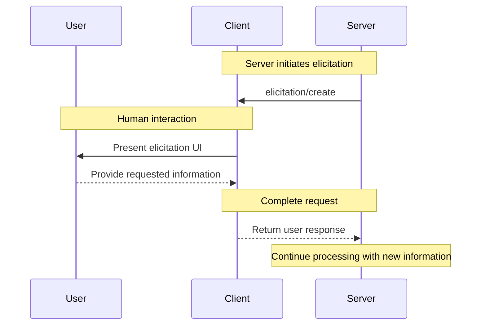

<div id="enable-section-numbers" />

<Info>**协议修订版**：2025-06-18</Info>

<Note>

引出是在此版本的 MCP 规范中新引入的，其设计可能在未来的协议版本中演变。

</Note>

模型上下文协议 (MCP) 提供了一种标准化的方式，允许服务器在交互期间通过客户端向用户请求额外信息。此流程允许客户端保持对用户交互和数据共享的控制，同时使服务器能够动态收集必要信息。服务器使用 JSON 模式向用户请求结构化数据以验证响应。

## 用户交互模型

MCP 中的引出允许服务器通过启用嵌套在其他 MCP 服务器功能内部的用户输入请求来实施交互式工作流程。

实现可以自由地通过适合其需求的任何界面模式公开引出——协议本身不强制任何特定的用户交互模型。

<Warning>

为了信任、安全和安全性：

- 服务器**不得**使用引出请求敏感信息。

应用程序**应该**：

- 提供清楚显示哪个服务器正在请求信息的 UI
- 允许用户在发送前审查和修改其响应
- 尊重用户隐私并提供明确的拒绝和取消选项

</Warning>

## 能力

支持引出的客户端**必须**在 [初始化](/specification/2025-06-18/basic/lifecycle#initialization) 期间声明 `elicitation` 能力：

```json
{
  "capabilities": {
    "elicitation": {}
  }
}
```

## Protocol Messages

### 创建引出请求

要向用户请求信息，服务器发送 `elicitation/create` 请求：

#### 简单文本请求

**请求：**

```json
{
  "jsonrpc": "2.0",
  "id": 1,
  "method": "elicitation/create",
  "params": {
    "message": "Please provide your GitHub username",
    "requestedSchema": {
      "type": "object",
      "properties": {
        "name": {
          "type": "string"
        }
      },
      "required": ["name"]
    }
  }
}
```

**响应：**

```json
{
  "jsonrpc": "2.0",
  "id": 1,
  "result": {
    "action": "accept",
    "content": {
      "name": "octocat"
    }
  }
}
```

#### 结构化数据请求

**请求：**

```json
{
  "jsonrpc": "2.0",
  "id": 2,
  "method": "elicitation/create",
  "params": {
    "message": "Please provide your contact information",
    "requestedSchema": {
      "type": "object",
      "properties": {
        "name": {
          "type": "string",
          "description": "Your full name"
        },
        "email": {
          "type": "string",
          "format": "email",
          "description": "Your email address"
        },
        "age": {
          "type": "number",
          "minimum": 18,
          "description": "Your age"
        }
      },
      "required": ["name", "email"]
    }
  }
}
```

**响应：**

```json
{
  "jsonrpc": "2.0",
  "id": 2,
  "result": {
    "action": "accept",
    "content": {
      "name": "Monalisa Octocat",
      "email": "octocat@github.com",
      "age": 30
    }
  }
}
```

**拒绝响应示例：**

```json
{
  "jsonrpc": "2.0",
  "id": 2,
  "result": {
    "action": "decline"
  }
}
```

**取消响应示例：**

```json
{
  "jsonrpc": "2.0",
  "id": 2,
  "result": {
    "action": "cancel"
  }
}
```

## 消息流程



## 请求模式

`requestedSchema` 字段允许服务器使用 JSON Schema 的受限子集定义预期响应的结构。为了简化客户端实现，引出模式仅限于具有原始属性的平面对象：

```json
"requestedSchema": {
  "type": "object",
  "properties": {
    "propertyName": {
      "type": "string",
      "title": "Display Name",
      "description": "Description of the property"
    },
    "anotherProperty": {
      "type": "number",
      "minimum": 0,
      "maximum": 100
    }
  },
  "required": ["propertyName"]
}
```

### 支持的模式类型

模式仅限于这些原始类型：

1. **字符串模式**

   ```json
   {
     "type": "string",
     "title": "Display Name",
     "description": "Description text",
     "minLength": 3,
     "maxLength": 50,
     "format": "email" // Supported: "email", "uri", "date", "date-time"
   }
   ```

   支持的格式：`email`、`uri`、`date`、`date-time`

2. **数字模式**

   ```json
   {
     "type": "number", // or "integer"
     "title": "Display Name",
     "description": "Description text",
     "minimum": 0,
     "maximum": 100
   }
   ```

3. **布尔模式**

   ```json
   {
     "type": "boolean",
     "title": "Display Name",
     "description": "Description text",
     "default": false
   }
   ```

4. **枚举模式**
   ```json
   {
     "type": "string",
     "title": "Display Name",
     "description": "Description text",
     "enum": ["option1", "option2", "option3"],
     "enumNames": ["Option 1", "Option 2", "Option 3"]
   }
   ```

客户端可以使用此模式来：

1. 生成适当的输入表单
2. 在发送前验证用户输入
3. 为用户提供更好的指导

请注意，复杂的嵌套结构、对象数组和其他高级 JSON Schema 功能被有意不支持，以简化客户端实现。

## 响应操作

引出响应使用三操作模型来清楚区分不同的用户操作：

```json
{
  "jsonrpc": "2.0",
  "id": 1,
  "result": {
    "action": "accept", // or "decline" or "cancel"
    "content": {
      "propertyName": "value",
      "anotherProperty": 42
    }
  }
}
```

三个响应操作是：

1. **接受** (`action: "accept"`)：用户明确批准并提交数据
   - `content` 字段包含与请求模式匹配的提交数据
   - 示例：用户点击了"提交"、"确定"、"确认"等。

2. **拒绝** (`action: "decline"`)：用户明确拒绝了请求
   - `content` 字段通常被省略
   - 示例：用户点击了"拒绝"、"拒绝"、"否"等。

3. **取消** (`action: "cancel"`)：用户在不做出明确选择的情况下关闭
   - `content` 字段通常被省略
   - 示例：用户关闭了对话框、点击外部、按下 Escape 等。

服务器应该适当处理每种状态：

- **接受**：处理提交的数据
- **拒绝**：处理明确拒绝（例如，提供替代方案）
- **取消**：处理关闭（例如，稍后再次提示）

## 安全考虑

1. 服务器**不得**通过引出请求敏感信息
2. 客户端**应该**实施用户批准控制
3. 双方**应该**根据提供的模式验证引出内容
4. 客户端**应该**清楚显示哪个服务器正在请求信息
5. 客户端**应该**允许用户随时拒绝引出请求
6. 客户端**应该**实施速率限制
7. 客户端**应该**以清楚显示正在请求什么信息以及为什么的方式呈现引出请求
