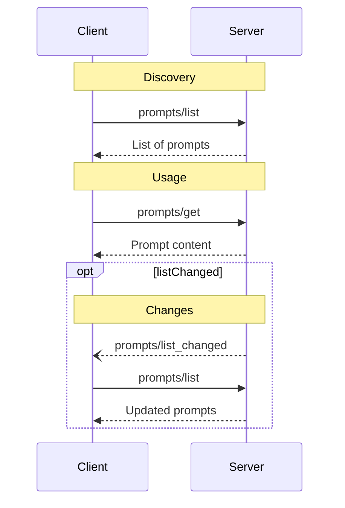

<div id="enable-section-numbers" />

<Info>**协议修订版**：2025-06-18</Info>

Model Context Protocol (MCP) 为服务器提供了一种标准化的方式来向客户端暴露提示模板。提示允许服务器提供结构化的消息和指令来与语言模型交互。客户端可以发现可用的提示、检索其内容，并提供参数来自定义它们。

## 用户交互模型

提示被设计为**用户控制**，这意味着它们从服务器暴露给客户端，目的是让用户能够明确选择它们进行使用。

通常，提示会通过用户界面中的用户发起的命令来触发，这允许用户自然地发现和调用可用的提示。

例如，作为斜杠命令：


但是，实现者可以自由地通过任何适合他们需求的界面模式来暴露提示——协议本身并不强制要求任何特定的用户交互模型。

## 能力

支持提示的服务器**必须**在[初始化](/specification/2025-06-18/basic/lifecycle#initialization)期间声明 `prompts` 能力：

```json
{
  "capabilities": {
    "prompts": {
      "listChanged": true
    }
  }
}
```

`listChanged` 表示当可用提示列表发生变化时，服务器是否会发出通知。

## 协议消息

### 列出提示

要检索可用的提示，客户端发送 `prompts/list` 请求。此操作支持[分页](/specification/2025-06-18/server/utilities/pagination)。

**请求：**

```json
{
  "jsonrpc": "2.0",
  "id": 1,
  "method": "prompts/list",
  "params": {
    "cursor": "optional-cursor-value"
  }
}
```

**响应：**

```json
{
  "jsonrpc": "2.0",
  "id": 1,
  "result": {
    "prompts": [
      {
        "name": "code_review",
        "title": "请求代码审查",
        "description": "要求 LLM 分析代码质量并提出改进建议",
        "arguments": [
          {
            "name": "code",
            "description": "要审查的代码",
            "required": true
          }
        ]
      }
    ],
    "nextCursor": "next-page-cursor"
  }
}
```

### 获取提示

要检索特定的提示，客户端发送 `prompts/get` 请求。参数可以通过[完成 API](/specification/2025-06-18/server/utilities/completion) 自动完成。

**请求：**

```json
{
  "jsonrpc": "2.0",
  "id": 2,
  "method": "prompts/get",
  "params": {
    "name": "code_review",
    "arguments": {
      "code": "def hello():\n    print('world')"
    }
  }
}
```

**响应：**

```json
{
  "jsonrpc": "2.0",
  "id": 2,
  "result": {
    "description": "代码审查提示",
    "messages": [
      {
        "role": "user",
        "content": {
          "type": "text",
          "text": "请审查这段 Python 代码：\ndef hello():\n    print('world')"
        }
      }
    ]
  }
}
```

### 列表变更通知

当可用提示列表发生变化时，声明了 `listChanged` 能力的服务器**应该**发送通知：

```json
{
  "jsonrpc": "2.0",
  "method": "notifications/prompts/list_changed"
}
```

## 消息流程



## 数据类型

### 提示

提示定义包括：

- `name`：提示的唯一标识符
- `title`：可选的用于显示目的的人类可读提示名称。
- `description`：可选的人类可读描述
- `arguments`：可选的参数列表用于自定义

### 提示消息

提示中的消息可以包含：

- `role`："user" 或 "assistant" 来指示说话者
- `content`：以下内容类型之一：

<Note>
  提示消息中的所有内容类型都支持可选的
  [注解](/specification/2025-06-18/server/resources#annotations) 用于
  关于受众、优先级和修改时间的元数据。
</Note>

#### 文本内容

文本内容表示纯文本消息：

```json
{
  "type": "text",
  "text": "消息的文本内容"
}
```

这是用于自然语言交互的最常见内容类型。

#### 图像内容

图像内容允许在消息中包含视觉信息：

```json
{
  "type": "image",
  "data": "base64-encoded-image-data",
  "mimeType": "image/png"
}
```

图像数据**必须**是 base64 编码的并包含有效的 MIME 类型。这启用了视觉上下文重要的多模态交互。

#### 音频内容

音频内容允许在消息中包含音频信息：

```json
{
  "type": "audio",
  "data": "base64-encoded-audio-data",
  "mimeType": "audio/wav"
}
```

音频数据必须是 base64 编码的并包含有效的 MIME 类型。这启用了音频上下文重要的多模态交互。

#### 嵌入资源

嵌入资源允许在消息中直接引用服务器端资源：

```json
{
  "type": "resource",
  "resource": {
    "uri": "resource://example",
    "name": "example",
    "title": "我的示例资源",
    "mimeType": "text/plain",
    "text": "资源内容"
  }
}
```

资源可以包含文本或二进制（blob）数据，并且**必须**包括：

- 有效的资源 URI
- 适当的 MIME 类型
- 文本内容或 base64 编码的 blob 数据

嵌入资源使提示能够无缝地将服务器管理的內容如文档、代码示例或其他参考材料直接纳入对话流程。

## 错误处理

服务器**应该**为常见故障情况返回标准 JSON-RPC 错误：

- 无效提示名称：`-32602` (无效参数)
- 缺少必需参数：`-32602` (无效参数)
- 内部错误：`-32603` (内部错误)

## 实现注意事项

1. 服务器**应该**在处理前验证提示参数
2. 客户端**应该**处理大型提示列表的分页
3. 双方**应该**尊重能力协商

## 安全性

实现**必须**仔细验证所有提示输入和输出以防止注入攻击或对资源的未授权访问。
