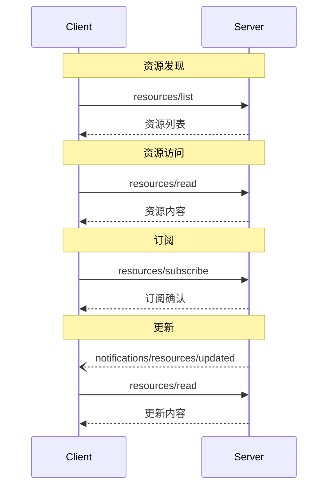

<div id="enable-section-numbers" />

<Info>**协议修订版**：2025-06-18</Info>

Model Context Protocol (MCP) 为服务器提供了一种标准化的方式来向客户端暴露资源。资源允许服务器共享为语言模型提供上下文的数据，例如文件、数据库模式或特定于应用程序的信息。每个资源由一个[URI](https://datatracker.ietf.org/doc/html/rfc3986) 唯一标识。

## 用户交互模型

MCP 中的资源被设计为**应用程序驱动**，主机应用程序根据其需求决定如何纳入上下文。

例如，应用程序可以：

- 通过 UI 元素暴露资源以进行显式选择，在树或列表视图中
- 允许用户搜索和过滤可用资源
- 实现自动上下文包含，基于启发式或 AI 模型的选择


但是，实现可以自由地通过任何适合其需求的界面模式来暴露资源——协议本身并不强制要求任何特定的用户交互模型。

## 能力

支持资源的服务器**必须**声明 `resources` 能力：

```json
{
  "capabilities": {
    "resources": {
      "subscribe": true,
      "listChanged": true
    }
  }
}
```

该能力支持两个可选功能：

- `subscribe`：客户端是否可以订阅以接收单个资源变更的通知。
- `listChanged`：当可用资源列表发生变化时，服务器是否会发出通知。

`subscribe` 和 `listChanged` 都是可选的——服务器可以不支持任何一个、任何一个或两个都支持：

```json
{
  "capabilities": {
    "resources": {} // 不支持任何功能
  }
}
```

```json
{
  "capabilities": {
    "resources": {
      "subscribe": true // 仅支持订阅
    }
  }
}
```

```json
{
  "capabilities": {
    "resources": {
      "listChanged": true // 仅支持列表变更通知
    }
  }
}
```

## 协议消息

### 列出资源

To discover available resources, clients send a `resources/list` request. This operation
supports [pagination](/specification/2025-06-18/server/utilities/pagination).

**Request:**

```json
{
  "jsonrpc": "2.0",
  "id": 1,
  "method": "resources/list",
  "params": {
    "cursor": "optional-cursor-value"
  }
}
```

**Response:**

```json
{
  "jsonrpc": "2.0",
  "id": 1,
  "result": {
    "resources": [
      {
        "uri": "file:///project/src/main.rs",
        "name": "main.rs",
        "title": "Rust Software Application Main File",
        "description": "Primary application entry point",
        "mimeType": "text/x-rust"
      }
    ],
    "nextCursor": "next-page-cursor"
  }
}
```

### 读取资源

要检索资源内容，客户端发送 `resources/read` 请求：

**请求：**

```json
{
  "jsonrpc": "2.0",
  "id": 2,
  "method": "resources/read",
  "params": {
    "uri": "file:///project/src/main.rs"
  }
}
```

**Response:**

```json
{
  "jsonrpc": "2.0",
  "id": 2,
  "result": {
    "contents": [
      {
        "uri": "file:///project/src/main.rs",
        "name": "main.rs",
        "title": "Rust Software Application Main File",
        "mimeType": "text/x-rust",
        "text": "fn main() {\n    println!(\"Hello world!\");\n}"
      }
    ]
  }
}
```

### 资源模板

资源模板允许服务器使用[URI 模板](https://datatracker.ietf.org/doc/html/rfc6570)暴露参数化资源。参数可以通过[完成 API](/specification/2025-06-18/server/utilities/completion) 自动完成。

**请求：**

```json
{
  "jsonrpc": "2.0",
  "id": 3,
  "method": "resources/templates/list"
}
```

**响应：**

```json
{
  "jsonrpc": "2.0",
  "id": 3,
  "result": {
    "resourceTemplates": [
      {
        "uriTemplate": "file:///{path}",
        "name": "项目文件",
        "title": "📁 项目文件",
        "description": "Access files in the project directory",
        "mimeType": "application/octet-stream"
      }
    ]
  }
}
```

### 列表变更通知

当可用资源列表发生变化时，声明了 `listChanged` 能力的服务器**应该**发送通知：

```json
{
  "jsonrpc": "2.0",
  "method": "notifications/resources/list_changed"
}
```

### 订阅

协议支持可选的资源变更订阅。客户端可以订阅特定资源并在它们发生变化时接收通知：

**订阅请求：**

```json
{
  "jsonrpc": "2.0",
  "id": 4,
  "method": "resources/subscribe",
  "params": {
    "uri": "file:///project/src/main.rs"
  }
}
```

**更新通知：**

```json
{
  "jsonrpc": "2.0",
  "method": "notifications/resources/updated",
  "params": {
    "uri": "file:///project/src/main.rs",
    "title": "Rust Software Application Main File"
  }
}
```

## 消息流程



## 数据类型

### 资源

资源定义包括：

- `uri`：资源的唯一标识符
- `name`：资源的名称。
- `title`：可选的用于显示目的的人类可读资源名称。
- `description`：可选描述
- `mimeType`：可选 MIME 类型
- `size`：可选的字节大小

### 资源内容

资源可以包含文本或二进制数据：

#### 文本内容

```json
{
  "uri": "file:///example.txt",
  "name": "example.txt",
  "title": "示例文本文件",
  "mimeType": "text/plain",
  "text": "资源内容"
}
```

#### 二进制内容

```json
{
  "uri": "file:///example.png",
  "name": "example.png",
  "title": "示例图像",
  "mimeType": "image/png",
  "blob": "base64-encoded-data"
}
```

### 注解

资源、资源模板和内容块支持可选的注解，这些注解为客户端提供关于如何使用或显示资源的提示：

- **`audience`**：一个数组，指示此资源的预期受众。有效值是 `"user"` 和 `"assistant"`。例如，`["user", "assistant"]` 表示对两者都有用的内容。
- **`priority`**：一个从 0.0 到 1.0 的数字，表示此资源的重要性。值为 1 表示"最重要"（实际上是必需的），而 0 表示"最不重要"（完全可选）。
- **`lastModified`**：一个 ISO 8601 格式的时间戳，表示资源最后修改的时间（例如，`"2025-01-12T15:00:58Z"`）。

带注解的资源示例：

```json
{
  "uri": "file:///project/README.md",
  "name": "README.md",
  "title": "项目文档",
  "mimeType": "text/markdown",
  "annotations": {
    "audience": ["user"],
    "priority": 0.8,
    "lastModified": "2025-01-12T15:00:58Z"
  }
}
```

客户端可以使用这些注解来：

- 根据预期受众过滤资源
- 优先考虑要在上下文中包含的资源
- 显示修改时间或按最近程度排序

## 常见 URI 方案

协议定义了几个标准 URI 方案。这个列表不是穷尽的——实现总是可以自由使用额外的自定义 URI 方案。

### https://

用于表示网络上可用的资源。

服务器**应该**仅在客户端能够自行从网络直接获取和加载资源时使用此方案——也就是说，它不需要通过 MCP 服务器读取资源。

对于其他用例，服务器**应该**更喜欢使用另一个 URI 方案，或定义一个自定义方案，即使服务器本身将通过互联网下载资源内容。

### file://

用于标识行为像文件系统的资源。但是，资源不需要映射到实际的物理文件系统。

MCP 服务器**可以**使用[XDG MIME 类型](https://specifications.freedesktop.org/shared-mime-info-spec/0.14/ar01s02.html#id-1.3.14)标识 file:// 资源，如 `inode/directory`，来表示没有标准 MIME 类型的非常规文件（如目录）。

### git://

Git 版本控制集成。

### 自定义 URI 方案

自定义 URI 方案**必须**符合 [RFC3986](https://datatracker.ietf.org/doc/html/rfc3986)，考虑到上述指导。

## 错误处理

服务器**应该**为常见故障情况返回标准 JSON-RPC 错误：

- 资源未找到：`-32002`
- 内部错误：`-32603`

错误示例：

```json
{
  "jsonrpc": "2.0",
  "id": 5,
  "error": {
    "code": -32002,
    "message": "资源未找到",
    "data": {
      "uri": "file:///nonexistent.txt"
    }
  }
}
```

## 安全注意事项

1. 服务器**必须**验证所有资源 URI
2. 敏感资源的访问控制**应该**被实现
3. 二进制数据**必须**被正确编码
4. 资源权限**应该**在操作前被检查
