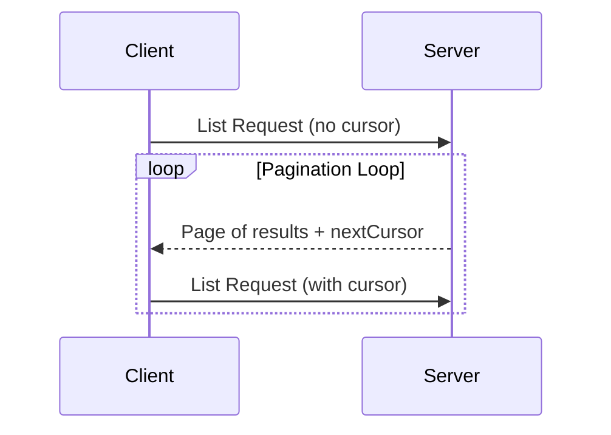

<div id="enable-section-numbers" />

<Info>**协议修订版**：2025-06-18</Info>

Model Context Protocol (MCP) 支持对可能返回大型结果集的列表操作进行分页。分页允许服务器以较小的块而不是一次性全部返回结果。

分页在通过互联网连接到外部服务时特别重要，但对于本地集成也很有用，以避免大型数据集的性能问题。

## 分页模型

MCP 中的分页使用不透明的基于游标的方法，而不是编号页面。

- **游标**是一个不透明的字符串令牌，表示结果集中的位置
- **页面大小**由服务器确定，客户端**不得**假设固定页面大小

## 响应格式

当服务器发送包含的分页开始：

- 当前页面的结果
- 如果存在更多结果，则可选的 `nextCursor` 字段

```json
{
  "jsonrpc": "2.0",
  "id": "123",
  "result": {
    "resources": [...],
    "nextCursor": "eyJwYWdlIjogM30="
  }
}
```

## 请求格式

在接收到游标后，客户端可以通过发出包含该游标的请求来_继续_分页：

```json
{
  "jsonrpc": "2.0",
  "id": "124",
  "method": "resources/list",
  "params": {
    "cursor": "eyJwYWdlIjogMn0="
  }
}
```

## 分页流程



## 支持分页的操作

以下 MCP 操作支持分页：

- `resources/list` - 列出可用资源
- `resources/templates/list` - 列出资源模板
- `prompts/list` - 列出可用提示
- `tools/list` - 列出可用工具

## 实现指南

1. 服务器**应该**：
   - 提供稳定的游标
   - 优雅地处理无效游标

2. 客户端**应该**：
   - 将缺失的 `nextCursor` 视为结果的结束
   - 支持分页和非分页流程

3. 客户端**必须**将游标视为不透明令牌：
   - 不要对游标格式做假设
   - 不要尝试解析或修改游标
   - 不要跨会话持久化游标

## 错误处理

无效游标**应该**导致代码为 -32602 (无效参数) 的错误。
