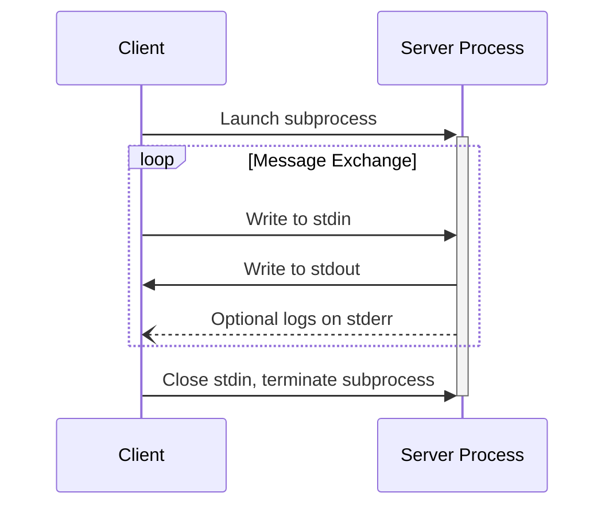
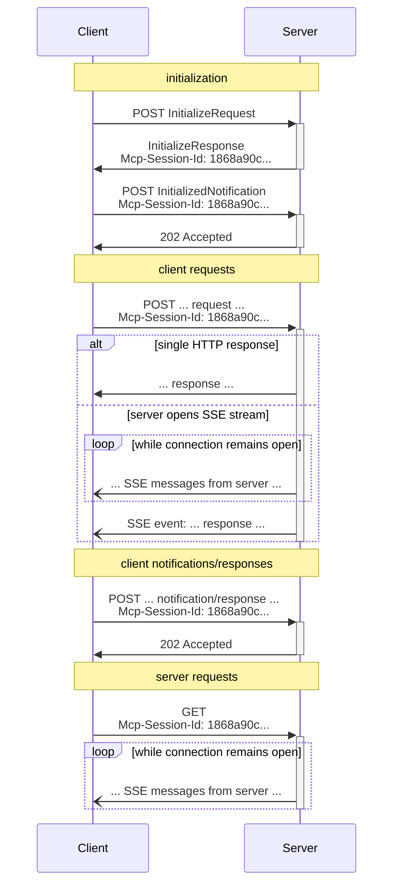

<Info>**协议修订版**：draft</Info>

MCP使用JSON-RPC对消息进行编码。JSON-RPC消息**必须**是UTF-8编码的。

该协议目前定义了两种标准的客户端-服务器通信传输机制：

1. [stdio](#stdio)，通过标准输入和标准输出进行通信
2. [可流式HTTP](#streamable-http)

客户端**应该**尽可能支持stdio。

客户端和服务器也可以以可插拔的方式实现[自定义传输](#custom-transports)。

## stdio

在**stdio**传输中：

- 客户端将MCP服务器作为子进程启动。
- 服务器从其标准输入（`stdin`）读取JSON-RPC消息，并向其标准输出（`stdout`）发送消息。
- 消息是单个JSON-RPC请求、通知或响应。
- 消息由换行符分隔，**不得**包含嵌入的换行符。
- 服务器**可以**将其标准错误（`stderr`）写入UTF-8字符串以进行日志记录。客户端**可以**捕获、转发或忽略此日志记录。
- 服务器**不得**将其`stdout`写入任何不是有效MCP消息的内容。
- 客户端**不得**向服务器的`stdin`写入任何不是有效MCP消息的内容。

## Streamable HTTP

<Info>

这替换了协议版本2024-11-05中的[HTTP+SSE传输](/specification/2024-11-05/basic/transports#http-with-sse)。请参阅下面的[向后兼容性](#backwards-compatibility)指南。

</Info>

在**可流式HTTP**传输中，服务器作为独立进程运行，可以处理多个客户端连接。此传输使用HTTP POST和GET请求。服务器可以选择使用[服务器发送事件](https://en.wikipedia.org/wiki/Server-sent_events)（SSE）来流式传输多个服务器消息。这允许基本的MCP服务器，以及支持流式传输和服务器到客户端通知和请求的更丰富的服务器。

服务器**必须**提供单个HTTP端点路径（以下简称**MCP端点**），该路径支持POST和GET方法。例如，这可以是像`https://example.com/mcp`这样的URL。

#### 安全警告

实施可流式HTTP传输时：

1. 服务器**必须**验证所有传入连接上的`Origin`头以防止DNS重新绑定攻击
   - 如果`Origin`头存在且无效，服务器**必须**以HTTP 403 Forbidden响应。HTTP响应体**可以**包含一个没有`id`的JSON-RPC _错误响应_
2. 在本地运行时，服务器**应该**仅绑定到localhost（127.0.0.1），而不是所有网络接口（0.0.0.0）
3. 服务器**应该**为所有连接实施适当的身份验证

如果没有这些保护，攻击者可以使用DNS重新绑定从远程网站与本地MCP服务器交互。

### 向服务器发送消息

从客户端发送的每个JSON-RPC消息**必须**是到MCP端点的新HTTP POST请求。

1. 客户端**必须**使用HTTP POST将JSON-RPC消息发送到MCP端点。
2. 客户端**必须**包含一个`Accept`头，列出`application/json`和`text/event-stream`作为支持的内容类型。
3. POST请求的主体**必须**是单个JSON-RPC _请求_、_通知_或_响应_。
4. 如果输入是JSON-RPC _响应_或_通知_：
   - 如果服务器接受输入，服务器**必须**返回HTTP状态码202 Accepted且无主体。
   - 如果服务器无法接受输入，它**必须**返回HTTP错误状态码（例如，400 Bad Request）。HTTP响应体**可以**包含一个没有`id`的JSON-RPC _错误响应_。
5. 如果输入是JSON-RPC _请求_，服务器**必须**返回`Content-Type: text/event-stream`以启动SSE流，或返回`Content-Type: application/json`以返回一个JSON对象。客户端**必须**支持这两种情况。
6. 如果服务器启动SSE流：
   - SSE流**应该**最终包含为POST主体中发送的JSON-RPC _请求_的JSON-RPC _响应_。
   - 服务器**可以**在发送JSON-RPC _响应_之前发送JSON-RPC _请求_和_通知_。这些消息**应该**与原始客户端_请求_相关。
   - 服务器**不应该**在发送接收到的JSON-RPC _请求_的JSON-RPC _响应_之前关闭SSE流，除非[会话](#session-management)过期。
   - 发送JSON-RPC _响应_后，服务器**应该**关闭SSE流。
   - 断开连接**可以**随时发生（例如，由于网络条件）。因此：
     - 断开连接**不应该**被解释为客户端取消其请求。
     - 要取消，客户端**应该**明确发送MCP `CancelledNotification`。
     - 为避免由于断开连接而丢失消息，服务器**可以**使流[可恢复](#resumability-and-redelivery)。

### 监听来自服务器的消息

1. 客户端**可以**向MCP端点发出HTTP GET。这可以用于打开SSE流，允许服务器与客户端通信，而客户端首先不通过HTTP POST发送数据。
2. 客户端**必须**包含一个`Accept`头，将`text/event-stream`列为支持的内容类型。
3. 服务器**必须**返回`Content-Type: text/event-stream`以响应此HTTP GET，或者返回HTTP 405 Method Not Allowed，表示服务器在此端点不提供SSE流。
4. 如果服务器启动SSE流：
   - 服务器**可以**在流上发送JSON-RPC _请求_和_通知_。
   - 这些消息**应该**与任何并发运行的客户端JSON-RPC _请求_无关。
   - 服务器**不得**在流上发送JSON-RPC _响应_，**除非**[恢复](#resumability-and-redelivery)与之前客户端请求关联的流。
   - 服务器**可以**随时关闭SSE流。
   - 客户端**可以**随时关闭SSE流。

### 多个连接

1. 客户端**可以**同时保持连接到多个SSE流。
2. 服务器**必须**仅在一个连接的流上发送其每个JSON-RPC消息；也就是说，它**不得**跨多个流广播相同消息。
   - 消息丢失的风险**可以**通过使流[可恢复](#resumability-and-redelivery)来缓解。

### 可恢复性和重新传递

为了支持恢复断开的连接，并重新传递可能丢失的消息：

1. Servers **MAY** attach an `id` field to their SSE events, as described in the
   [SSE standard](https://html.spec.whatwg.org/multipage/server-sent-events.html#event-stream-interpretation).
   - If present, the ID **MUST** be globally unique across all streams within that
     [session](#session-management)—or all streams with that specific client, if session
     management is not in use.
2. If the client wishes to resume after a broken connection, it **SHOULD** issue an HTTP
   GET to the MCP endpoint, and include the
   [`Last-Event-ID`](https://html.spec.whatwg.org/multipage/server-sent-events.html#the-last-event-id-header)
   header to indicate the last event ID it received.
   - The server **MAY** use this header to replay messages that would have been sent
     after the last event ID, _on the stream that was disconnected_, and to resume the
     stream from that point.
   - The server **MUST NOT** replay messages that would have been delivered on a
     different stream.

In other words, these event IDs should be assigned by servers on a _per-stream_ basis, to
act as a cursor within that particular stream.

### Session Management

An MCP "session" consists of logically related interactions between a client and a
server, beginning with the [initialization phase](/specification/draft/basic/lifecycle). To support
servers which want to establish stateful sessions:

1. A server using the Streamable HTTP transport **MAY** assign a session ID at
   initialization time, by including it in an `Mcp-Session-Id` header on the HTTP
   response containing the `InitializeResult`.
   - The session ID **SHOULD** be globally unique and cryptographically secure (e.g., a
     securely generated UUID, a JWT, or a cryptographic hash).
   - The session ID **MUST** only contain visible ASCII characters (ranging from 0x21 to
     0x7E).
2. If an `Mcp-Session-Id` is returned by the server during initialization, clients using
   the Streamable HTTP transport **MUST** include it in the `Mcp-Session-Id` header on
   all of their subsequent HTTP requests.
   - Servers that require a session ID **SHOULD** respond to requests without an
     `Mcp-Session-Id` header (other than initialization) with HTTP 400 Bad Request.
3. The server **MAY** terminate the session at any time, after which it **MUST** respond
   to requests containing that session ID with HTTP 404 Not Found.
4. 当客户端收到对包含`Mcp-Session-Id`的请求的HTTP 404响应时，它**必须**通过发送不附加会话ID的新`InitializeRequest`来启动新会话。
5. 不再需要特定会话的客户端（例如，因为用户正在离开客户端应用程序）**应该**使用`Mcp-Session-Id`头向MCP端点发送HTTP DELETE，以明确终止会话。
   - 服务器**可以**以HTTP 405 Method Not Allowed响应此请求，表示服务器不允许客户端终止会话。

### 时序图

### 协议版本头

如果使用HTTP，客户端**必须**在所有后续对MCP服务器的请求中包含`MCP-Protocol-Version: <protocol-version>` HTTP头，允许MCP服务器基于MCP协议版本进行响应。

例如：`MCP-Protocol-Version: 2025-06-18`

客户端发送的协议版本**应该**是在[初始化期间协商的](/specification/draft/basic/lifecycle#version-negotiation)版本。

为了向后兼容，如果服务器没有收到`MCP-Protocol-Version`头，并且没有其他方式识别版本 - 例如，通过依赖在初始化期间协商的协议版本 - 服务器**应该**假设协议版本为`2025-03-26`。

如果服务器收到带有无效或不支持的`MCP-Protocol-Version`的请求，它**必须**以`400 Bad Request`响应。

### 向后兼容性

客户端和服务器可以通过以下方式保持与已弃用的[HTTP+SSE传输](/specification/2024-11-05/basic/transports#http-with-sse)（来自协议版本2024-11-05）的向后兼容性：

**希望支持旧客户端的服务器应该：**

- 继续托管旧传输的SSE和POST端点，以及为可流式HTTP传输定义的新"MCP端点"。
  - 也可以组合旧的POST端点和新MCP端点，但这可能会引入不必要的复杂性。

**希望支持旧服务器的客户端应该：**

1. 从用户接受MCP服务器URL，该URL可能指向使用旧传输或新传输的服务器。
2. 尝试使用上面定义的`Accept`头向服务器URL POST `InitializeRequest`：
   - 如果成功，客户端可以假设这是一个支持新可流式HTTP传输的服务器。
   - 如果它以HTTP 4xx状态码失败（例如，405 Method Not Allowed或404 Not Found）：
     - 向服务器URL发出GET请求，期望这将打开SSE流并返回`endpoint`事件作为第一个事件。
     - 当`endpoint`事件到达时，客户端可以假设这是一个运行旧HTTP+SSE传输的服务器，并应该为所有后续通信使用该传输。

## 自定义传输

客户端和服务器**可以**实施额外的自定义传输机制以满足其特定需求。该协议与传输无关，可以在任何支持双向消息交换的通信通道上实施。

选择支持自定义传输的实施者**必须**确保它们保留MCP定义的JSON-RPC消息格式和生命周期要求。自定义传输**应该**记录其特定的连接建立和消息交换模式，以帮助互操作性。
