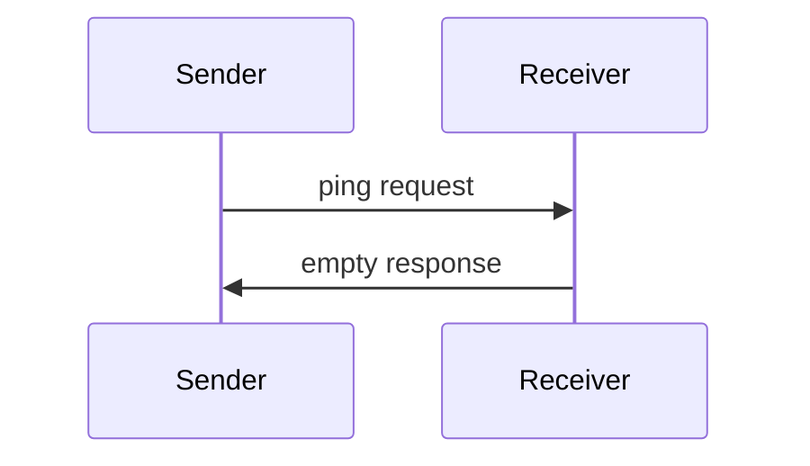

<div id="enable-section-numbers" />

<Info>**协议修订版**：draft</Info>

Model Context Protocol包含一个可选的ping机制，允许任何一方验证其对应方是否仍然响应且连接是否存活。

## 概述

ping功能通过简单的请求/响应模式实施。客户端或服务器都可以通过发送`ping`请求来启动ping。

## 消息格式

ping请求是一个没有参数的标准JSON-RPC请求：

```json
{
  "jsonrpc": "2.0",
  "id": "123",
  "method": "ping"
}
```

## 行为要求

1. 接收者**必须**立即以空响应响应：

```json
{
  "jsonrpc": "2.0",
  "id": "123",
  "result": {}
}
```

2. 如果在合理超时时间内没有收到响应，发送者**可以**：
   - 认为连接已过时
   - 终止连接
   - 尝试重新连接过程

## 使用模式



## 实施考虑

- 实施**应该**定期发出ping以检测连接健康状况
- ping的频率**应该**是可配置的
- 超时**应该**适合网络环境
- **应该**避免过度ping以减少网络开销

## 错误处理

- 超时**应该**被视为连接失败
- 多个失败的ping**可以**触发连接重置
- 实施**应该**记录ping失败以进行诊断
