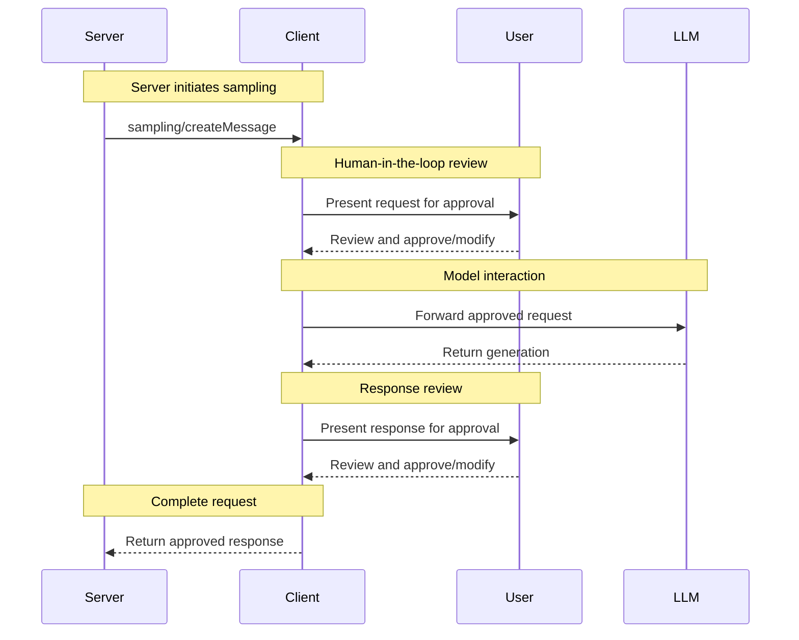

<div id="enable-section-numbers" />

<Info>**协议修订版**：draft</Info>

Model Context Protocol (MCP)为服务器提供了一种标准化的方式，通过客户端从语言模型请求LLM采样（"补全"或"生成"）。此流程允许客户端保持对模型访问、选择和权限的控制，同时使服务器能够利用AI能力 - 无需服务器API密钥。服务器可以请求文本、音频或基于图像的交互，并可选地在它们的提示中包含来自MCP服务器的上下文。

## 用户交互模型

MCP中的采样允许服务器通过启用嵌套在其他MCP服务器功能内部的LLM调用来实施代理行为。

实施可以自由地通过适合其需求的任何界面模式公开采样 - 协议本身不强制任何特定的用户交互模型。

<Warning>

为了信任、安全和安全性，**应该**始终有人在回路中，能够拒绝采样请求。

应用程序**应该**：

- 提供使审查采样请求变得容易和直观的用户界面
- 允许用户在发送前查看和编辑提示
- 在交付前呈现生成的响应以供审查

</Warning>

## 能力

支持采样的客户端**必须**在[初始化](/specification/draft/basic/lifecycle#initialization)期间声明`sampling`能力：

```json
{
  "capabilities": {
    "sampling": {}
  }
}
```

## Protocol Messages

### Creating Messages

To request a language model generation, servers send a `sampling/createMessage` request:

**Request:**

```json
{
  "jsonrpc": "2.0",
  "id": 1,
  "method": "sampling/createMessage",
  "params": {
    "messages": [
      {
        "role": "user",
        "content": {
          "type": "text",
          "text": "What is the capital of France?"
        }
      }
    ],
    "modelPreferences": {
      "hints": [
        {
          "name": "claude-3-sonnet"
        }
      ],
      "intelligencePriority": 0.8,
      "speedPriority": 0.5
    },
    "systemPrompt": "You are a helpful assistant.",
    "maxTokens": 100
  }
}
```

**响应：**

```json
{
  "jsonrpc": "2.0",
  "id": 1,
  "result": {
    "role": "assistant",
    "content": {
      "type": "text",
      "text": "The capital of France is Paris."
    },
    "model": "claude-3-sonnet-20240307",
    "stopReason": "endTurn"
  }
}
```

## 消息流程



## 数据类型

### 消息

采样消息可以包含：

#### 文本内容

```json
{
  "type": "text",
  "text": "The message content"
}
```

#### 图像内容

```json
{
  "type": "image",
  "data": "base64-encoded-image-data",
  "mimeType": "image/jpeg"
}
```

#### 音频内容

```json
{
  "type": "audio",
  "data": "base64-encoded-audio-data",
  "mimeType": "audio/wav"
}
```

### 模型偏好

MCP中的模型选择需要仔细抽象，因为服务器和客户端可能使用不同的AI提供商，具有不同的模型产品。服务器不能简单地通过名称请求特定模型，因为客户端可能无法访问该确切模型，或者可能更喜欢使用不同提供商的等效模型。

为了解决这个问题，MCP实施了一个偏好系统，将抽象能力优先级与可选的模型提示相结合：

#### 能力优先级

服务器通过三个标准化的优先级值（0-1）表达其需求：

- `costPriority`：最小化成本有多重要？更高的值偏好更便宜的模型。
- `speedPriority`：低延迟有多重要？更高的值偏好更快的模型。
- `intelligencePriority`：高级能力有多重要？更高的值偏好更强大的模型。

#### 模型提示

虽然优先级有助于基于特征选择模型，但`hints`允许服务器建议特定模型或模型系列：

- 提示被视为可以灵活匹配模型名称的子字符串
- 多个提示按偏好顺序评估
- 客户端**可以**将提示映射到来自不同提供商的等效模型
- 提示是建议性的 - 客户端做出最终模型选择

例如：

```json
{
  "hints": [
    { "name": "claude-3-sonnet" }, // 偏好Sonnet级模型
    { "name": "claude" } // 回退到任何Claude模型
  ],
  "costPriority": 0.3, // 成本不太重要
  "speedPriority": 0.8, // 速度非常重要
  "intelligencePriority": 0.5 // 中等能力需求
}
```

客户端处理这些偏好以从其可用选项中选择适当的模型。例如，如果客户端无法访问Claude模型但有Gemini，它可能会根据类似能力将sonnet提示映射到`gemini-1.5-pro`。

## 错误处理

客户端**应该**为常见失败情况返回错误：

错误示例：

```json
{
  "jsonrpc": "2.0",
  "id": 1,
  "error": {
    "code": -1,
    "message": "User rejected sampling request"
  }
}
```

## 安全考虑

1. 客户端**应该**实施用户批准控制
2. 双方**应该**验证消息内容
3. 客户端**应该**尊重模型偏好提示
4. 客户端**应该**实施速率限制
5. 双方**必须**适当处理敏感数据
