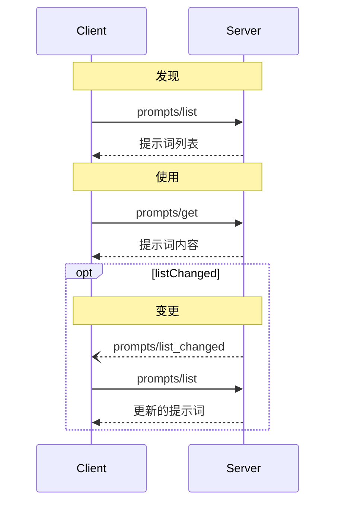

<div id="enable-section-numbers" />

<Info>**协议修订版**: draft</Info>

Model Context Protocol (MCP) 为服务器提供了一种标准化的方式来向客户端暴露提示词模板。提示词允许服务器提供结构化的消息和指令，用于与语言模型交互。客户端可以发现可用的提示词、检索其内容，并提供参数来自定义它们。

## 用户交互模型

提示词被设计为**用户控制**的，这意味着它们从服务器暴露给客户端，目的是让用户能够明确选择使用它们。

通常，提示词会通过用户界面中的用户发起命令来触发，这允许用户自然地发现和调用可用的提示词。

例如，作为斜杠命令：


但是，实现者可以自由地通过任何适合其需求的界面模式来暴露提示词——协议本身并不强制要求任何特定的用户交互模型。

## 能力

支持提示词的服务器**必须**在[初始化](/specification/draft/basic/lifecycle#initialization)期间声明 `prompts` 能力：

```json
{
  "capabilities": {
    "prompts": {
      "listChanged": true
    }
  }
}
```

`listChanged` 表示当可用提示词列表发生变化时，服务器是否会发出通知。

## 协议消息

### 列出提示词

要检索可用的提示词，客户端发送 `prompts/list` 请求。此操作支持[分页](/specification/draft/server/utilities/pagination)。

**请求：**

```json
{
  "jsonrpc": "2.0",
  "id": 1,
  "method": "prompts/list",
  "params": {
    "cursor": "optional-cursor-value"
  }
}
```

**响应：**

```json
{
  "jsonrpc": "2.0",
  "id": 1,
  "result": {
    "prompts": [
      {
        "name": "code_review",
        "title": "请求代码审查",
        "description": "要求 LLM 分析代码质量并提出改进建议",
        "arguments": [
          {
            "name": "code",
            "description": "要审查的代码",
            "required": true
          }
        ],
        "icons": [
          {
            "src": "https://example.com/review-icon.svg",
            "mimeType": "image/svg+xml",
            "sizes": ["any"]
          }
        ]
      }
    ],
    "nextCursor": "next-page-cursor"
  }
}
```

### 获取提示词

要检索特定的提示词，客户端发送 `prompts/get` 请求。参数可以通过[完成 API](/specification/draft/server/utilities/completion) 进行自动完成。

**请求：**

```json
{
  "jsonrpc": "2.0",
  "id": 2,
  "method": "prompts/get",
  "params": {
    "name": "code_review",
    "arguments": {
      "code": "def hello():\n    print('world')"
    }
  }
}
```

**响应：**

```json
{
  "jsonrpc": "2.0",
  "id": 2,
  "result": {
    "description": "代码审查提示词",
    "messages": [
      {
        "role": "user",
        "content": {
          "type": "text",
          "text": "请审查这段 Python 代码：\ndef hello():\n    print('world')"
        }
      }
    ]
  }
}
```

### 列表变更通知

当可用提示词列表发生变化时，声明了 `listChanged` 能力的服务器**应该**发送通知：

```json
{
  "jsonrpc": "2.0",
  "method": "notifications/prompts/list_changed"
}
```

## 消息流程



## 数据类型

### 提示词

提示词定义包括：

- `name`：提示词的唯一标识符
- `title`：可选的用于显示的人类可读名称
- `description`：可选的人类可读描述
- `arguments`：可选的参数列表，用于自定义

### 提示词消息

提示词中的消息可以包含：

- `role`：表示说话者的 "user" 或 "assistant"
- `content`：以下内容类型之一：

<Note>
  提示词消息中的所有内容类型都支持可选的
  [注解](/specification/2025-06-18/server/resources#annotations)，用于
  关于受众、优先级和修改时间的元数据。
</Note>

#### 文本内容

文本内容表示纯文本消息：

```json
{
  "type": "text",
  "text": "消息的文本内容"
}
```

这是用于自然语言交互的最常见内容类型。

#### 图像内容

图像内容允许在消息中包含视觉信息：

```json
{
  "type": "image",
  "data": "base64-encoded-image-data",
  "mimeType": "image/png"
}
```

图像数据**必须**是 base64 编码的，并包含有效的 MIME 类型。这支持视觉上下文重要的多模态交互。

#### 音频内容

音频内容允许在消息中包含音频信息：

```json
{
  "type": "audio",
  "data": "base64-encoded-audio-data",
  "mimeType": "audio/wav"
}
```

音频数据必须是 base64 编码的，并包含有效的 MIME 类型。这支持音频上下文重要的多模态交互。

#### 嵌入资源

嵌入资源允许在消息中直接引用服务器端资源：

```json
{
  "type": "resource",
  "resource": {
    "uri": "resource://example",
    "mimeType": "text/plain",
    "text": "资源内容"
  }
}
```

资源可以包含文本或二进制（blob）数据，并且**必须**包含：

- 有效的资源 URI
- 适当的 MIME 类型
- 文本内容或 base64 编码的 blob 数据

嵌入资源使提示词能够无缝地将服务器管理的內容（如文档、代码示例或其他参考材料）直接纳入对话流程。

## 错误处理

服务器**应该**为常见故障情况返回标准的 JSON-RPC 错误：

- 无效的提示词名称：`-32602`（无效参数）
- 缺少必需参数：`-32602`（无效参数）
- 内部错误：`-32603`（内部错误）

## 实现注意事项

1. 服务器**应该**在处理前验证提示词参数
2. 客户端**应该**处理大型提示词列表的分页
3. 双方**应该**尊重能力协商

## 安全

实现**必须**仔细验证所有提示词输入和输出，以防止注入攻击或对资源的未授权访问。
