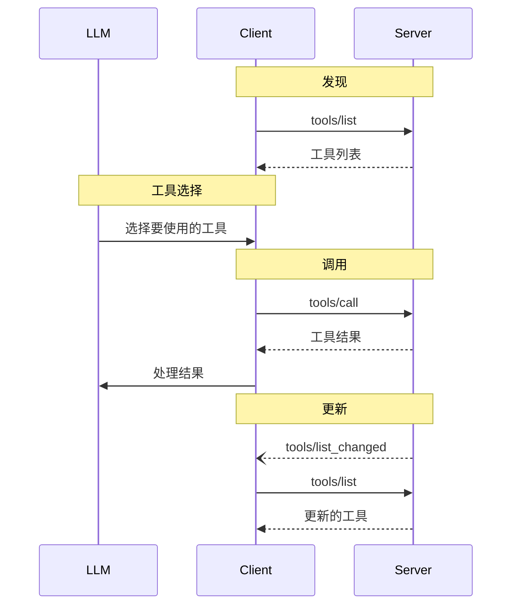

<div id="enable-section-numbers" />

<Info>**协议修订版**: draft</Info>

Model Context Protocol (MCP) 允许服务器暴露可以被语言模型调用的工具。工具使模型能够与外部系统交互，例如查询数据库、调用 API 或执行计算。每个工具都由名称唯一标识，并包含描述其模式的元数据。

## 用户交互模型

MCP 中的工具被设计为**模型控制**的，这意味着语言模型可以基于其上下文理解和用户的提示自动发现和调用工具。

但是，实现可以自由地通过任何适合其需求的界面模式来暴露工具——协议本身并不强制要求任何特定的用户交互模型。

<Warning>

为了信任、安全和安全性，**应该**始终有人工介入，能够拒绝工具调用。

应用程序**应该**：

- 提供清晰显示哪些工具被暴露给 AI 模型的 UI
- 在工具被调用时插入清晰的视觉指示器
- 为操作呈现确认提示给用户，以确保有人工介入

</Warning>

## 能力

支持工具的服务器**必须**声明 `tools` 能力：

```json
{
  "capabilities": {
    "tools": {
      "listChanged": true
    }
  }
}
```

`listChanged` 表示当可用工具列表发生变化时，服务器是否会发出通知。

## 协议消息

### 列出工具

要发现可用工具，客户端发送 `tools/list` 请求。此操作支持[分页](/specification/draft/server/utilities/pagination)。

**请求：**

```json
{
  "jsonrpc": "2.0",
  "id": 1,
  "method": "tools/list",
  "params": {
    "cursor": "optional-cursor-value"
  }
}
```

**响应：**

```json
{
  "jsonrpc": "2.0",
  "id": 1,
  "result": {
    "tools": [
      {
        "name": "get_weather",
        "title": "天气信息提供者",
        "description": "获取某个位置的当前天气信息",
        "inputSchema": {
          "type": "object",
          "properties": {
            "location": {
              "type": "string",
              "description": "城市名称或邮政编码"
            }
          },
          "required": ["location"]
        },
        "icons": [
          {
            "src": "https://example.com/weather-icon.png",
            "mimeType": "image/png",
            "sizes": ["48x48"]
          }
        ]
      }
    ],
    "nextCursor": "next-page-cursor"
  }
}
```

### 调用工具

要调用工具，客户端发送 `tools/call` 请求：

**请求：**

```json
{
  "jsonrpc": "2.0",
  "id": 2,
  "method": "tools/call",
  "params": {
    "name": "get_weather",
    "arguments": {
      "location": "New York"
    }
  }
}
```

**响应：**

```json
{
  "jsonrpc": "2.0",
  "id": 2,
  "result": {
    "content": [
      {
        "type": "text",
        "text": "纽约当前天气：\n温度：72°F\n状况：多云"
      }
    ],
    "isError": false
  }
}
```

### 列表变更通知

当可用工具列表发生变化时，声明了 `listChanged` 能力的服务器**应该**发送通知：

```json
{
  "jsonrpc": "2.0",
  "method": "notifications/tools/list_changed"
}
```

## 消息流程



## 数据类型

### 工具

工具定义包括：

- `name`：工具的唯一标识符
- `title`：可选的用于显示的人类可读工具名称
- `description`：功能的人类可读描述
- `inputSchema`：定义预期参数的 JSON Schema
- `outputSchema`：可选的定义预期输出结构的 JSON Schema
- `annotations`：可选的描述工具行为的属性

<Warning>

为了信任、安全和安全性，客户端**必须**将工具注解视为不可信的，除非它们来自受信任的服务器。

</Warning>

#### 工具名称

- 工具名称应该在 1 到 128 个字符长度之间（包括）。
- 工具名称应该被视为区分大小写。
- 以下应该是唯一允许的字符：大写和小写 ASCII 字母 (A-Z, a-z)、数字 (0-9)、下划线 (_)、破折号 (-) 和点 (.)
- 工具名称不应该包含空格、逗号或其他特殊字符。
- 工具名称在服务器内应该是唯一的。
- 有效的工具名称示例：
  - getUser
  - DATA_EXPORT_v2
  - admin.tools.list

### 工具结果

工具结果可能包含[**结构化**](#structured-content)或**非结构化**内容。

**非结构化**内容在结果的 `content` 字段中返回，可以包含不同类型的多个内容项：

<Note>
  所有内容类型（文本、图像、音频、资源链接和嵌入资源）都支持可选的
  [注解](/specification/draft/server/resources#annotations)，这些注解提供
  关于受众、优先级和修改时间的元数据。这是资源和提示词使用的相同
  注解格式。
</Note>

#### 文本内容

```json
{
  "type": "text",
  "text": "工具结果文本"
}
```

#### 图像内容

```json
{
  "type": "image",
  "data": "base64-encoded-data",
  "mimeType": "image/png",
  "annotations": {
    "audience": ["user"],
    "priority": 0.9
  }
}
```

#### 音频内容

```json
{
  "type": "audio",
  "data": "base64-encoded-audio-data",
  "mimeType": "audio/wav"
}
```

#### 资源链接

工具**可以**返回指向[资源](/specification/draft/server/resources)的链接，以提供额外上下文或数据。在这种情况下，工具将返回一个可以被客户端订阅或获取的 URI：

```json
{
  "type": "resource_link",
  "uri": "file:///project/src/main.rs",
  "name": "main.rs",
  "description": "主要应用程序入口点",
  "mimeType": "text/x-rust"
}
```

资源链接支持与常规资源相同的[资源注解](/specification/draft/server/resources#annotations)，以帮助客户端了解如何使用它们。

<Info>
  工具返回的资源链接不能保证出现在 `resources/list` 请求的结果中。
</Info>

#### 嵌入资源

[资源](/specification/draft/server/resources)**可以**被嵌入以提供额外上下文或数据，使用合适的[URI 方案](./resources#common-uri-schemes)。使用嵌入资源的服务器**应该**实现 `resources` 能力：

```json
{
  "type": "resource",
  "resource": {
    "uri": "file:///project/src/main.rs",
    "mimeType": "text/x-rust",
    "text": "fn main() {\n    println!(\"Hello world!\");\n}",
    "annotations": {
      "audience": ["user", "assistant"],
      "priority": 0.7,
      "lastModified": "2025-05-03T14:30:00Z"
    }
  }
}
```

嵌入资源支持与常规资源相同的[资源注解](/specification/draft/server/resources#annotations)，以帮助客户端了解如何使用它们。

#### 结构化内容

**结构化**内容作为 JSON 对象在结果的 `structuredContent` 字段中返回。

为了向后兼容，返回结构化内容的工具也应该在 TextContent 块中返回序列化的 JSON。

#### 输出模式

工具也可以为结构化结果的验证提供输出模式。
如果提供了输出模式：

- 服务器**必须**提供符合此模式的结构化结果。
- 客户端**应该**根据此模式验证结构化结果。

带有输出模式的工具示例：

```json
{
  "name": "get_weather_data",
  "title": "天气数据检索器",
  "description": "获取某个位置的当前天气数据",
  "inputSchema": {
    "type": "object",
    "properties": {
      "location": {
        "type": "string",
        "description": "城市名称或邮政编码"
      }
    },
    "required": ["location"]
  },
  "outputSchema": {
    "type": "object",
    "properties": {
      "temperature": {
        "type": "number",
        "description": "摄氏度温度"
      },
      "conditions": {
        "type": "string",
        "description": "天气状况描述"
      },
      "humidity": {
        "type": "number",
        "description": "湿度百分比"
      }
    },
    "required": ["temperature", "conditions", "humidity"]
  }
}
```

此工具的有效响应示例：

```json
{
  "jsonrpc": "2.0",
  "id": 5,
  "result": {
    "content": [
      {
        "type": "text",
        "text": "{\"temperature\": 22.5, \"conditions\": \"Partly cloudy\", \"humidity\": 65}"
      }
    ],
    "structuredContent": {
      "temperature": 22.5,
      "conditions": "Partly cloudy",
      "humidity": 65
    }
  }
}
```

提供输出模式有助于客户端和 LLM 通过以下方式理解和正确处理结构化工具输出：

- 启用对响应的严格模式验证
- 为更好地与编程语言集成提供类型信息
- 指导客户端和 LLM 正确解析和利用返回的数据
- 支持更好的文档和开发者体验

## 错误处理

工具使用两种错误报告机制：

1. **协议错误**：用于如下问题的标准 JSON-RPC 错误：
   - 未知工具
   - 无效参数
   - 服务器错误

2. **工具执行错误**：在工具结果中报告，带有 `isError: true`：
   - API 失败
   - 无效输入数据
   - 业务逻辑错误

协议错误示例：

```json
{
  "jsonrpc": "2.0",
  "id": 3,
  "error": {
    "code": -32602,
    "message": "未知工具：invalid_tool_name"
  }
}
```

工具执行错误示例：

```json
{
  "jsonrpc": "2.0",
  "id": 4,
  "result": {
    "content": [
      {
        "type": "text",
        "text": "获取天气数据失败：API 速率限制超出"
      }
    ],
    "isError": true
  }
}
```

## 安全注意事项

1. 服务器**必须**：
   - 验证所有工具输入
   - 实现适当的访问控制
   - 对工具调用进行速率限制
   - 清理工具输出

2. 客户端**应该**：
   - 对敏感操作提示用户确认
   - 在调用服务器之前向用户显示工具输入，以避免恶意或意外的数据泄露
   - 在传递给 LLM 之前验证工具结果
   - 为工具调用实现超时
   - 为审计目的记录工具使用情况
