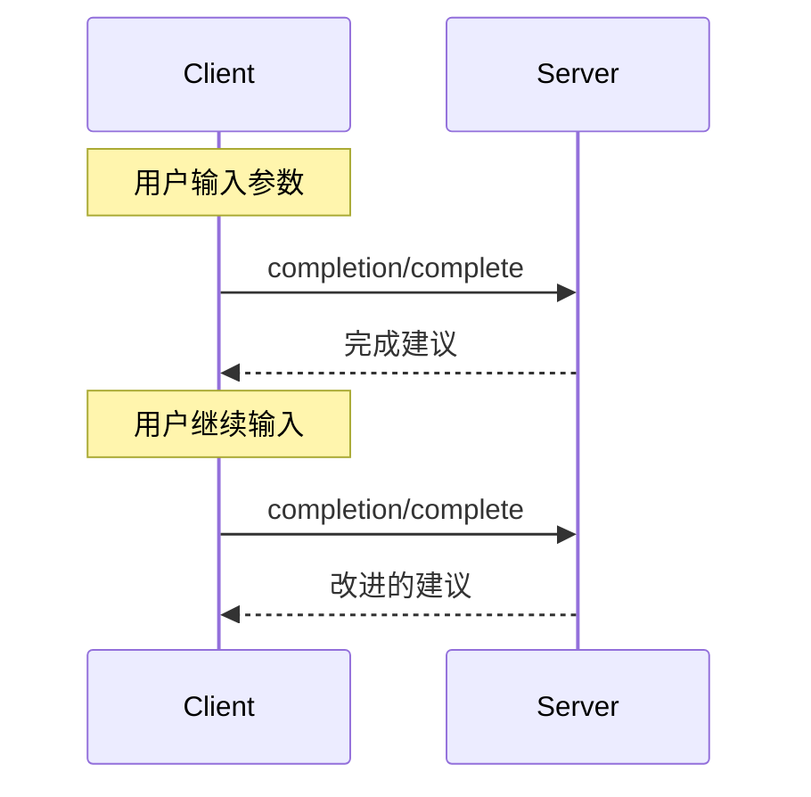

<div id="enable-section-numbers" />

<Info>**协议修订版**: draft</Info>

Model Context Protocol (MCP) 为服务器提供了一种标准化的方式来为提示词和资源模板的参数提供自动完成建议。当用户为特定提示词（通过名称标识）或资源模板（通过 URI 标识）填写参数值时，服务器可以提供上下文相关的建议。

## 用户交互模型

MCP 中的完成被设计为支持类似于 IDE 代码完成的交互式用户体验。

例如，应用程序可以在用户输入时在下拉菜单或弹出菜单中显示完成建议，并能够过滤和选择可用选项。

但是，实现可以自由地通过任何适合其需求的界面模式来暴露完成——协议本身并不强制要求任何特定的用户交互模型。

## 能力

支持完成的服务器**必须**声明 `completions` 能力：

```json
{
  "capabilities": {
    "completions": {}
  }
}
```

## 协议消息

### 请求完成

要获取完成建议，客户端发送 `completion/complete` 请求，通过引用类型指定正在完成的内容：

**请求：**

```json
{
  "jsonrpc": "2.0",
  "id": 1,
  "method": "completion/complete",
  "params": {
    "ref": {
      "type": "ref/prompt",
      "name": "code_review"
    },
    "argument": {
      "name": "language",
      "value": "py"
    }
  }
}
```

**响应：**

```json
{
  "jsonrpc": "2.0",
  "id": 1,
  "result": {
    "completion": {
      "values": ["python", "pytorch", "pyside"],
      "total": 10,
      "hasMore": true
    }
  }
}
```

对于具有多个参数的提示词或 URI 模板，客户端应该在 `context.arguments` 对象中包含之前的完成，以为后续请求提供上下文。

**请求：**

```json
{
  "jsonrpc": "2.0",
  "id": 1,
  "method": "completion/complete",
  "params": {
    "ref": {
      "type": "ref/prompt",
      "name": "code_review"
    },
    "argument": {
      "name": "framework",
      "value": "fla"
    },
    "context": {
      "arguments": {
        "language": "python"
      }
    }
  }
}
```

**响应：**

```json
{
  "jsonrpc": "2.0",
  "id": 1,
  "result": {
    "completion": {
      "values": ["flask"],
      "total": 1,
      "hasMore": false
    }
  }
}
```

### 引用类型

协议支持两种类型的完成引用：

| 类型           | 描述               | 示例                                                |
| -------------- | ------------------ | --------------------------------------------------- |
| `ref/prompt`   | 通过名称引用提示词 | `{"type": "ref/prompt", "name": "code_review"}`     |
| `ref/resource` | 通过 URI 引用资源  | `{"type": "ref/resource", "uri": "file:///{path}"}` |

### 完成结果

服务器返回按相关性排序的完成值数组，具有：

- 每个响应最多 100 项
- 可选的可用匹配总数
- 指示是否存在额外结果的布尔值

## 消息流程



## 数据类型

### CompleteRequest

- `ref`：`PromptReference` 或 `ResourceReference`
- `argument`：包含的对象：
  - `name`：参数名称
  - `value`：当前值
- `context`：包含的对象：
  - `arguments`：已解析的参数名称到其值的映射。

### CompleteResult

- `completion`：包含的对象：
  - `values`：建议数组（最多 100 个）
  - `total`：可选的匹配总数
  - `hasMore`：额外结果标志

## 错误处理

服务器**应该**为常见故障情况返回标准的 JSON-RPC 错误：

- 方法未找到：`-32601`（不支持能力）
- 无效的提示词名称：`-32602`（无效参数）
- 缺少必需参数：`-32602`（无效参数）
- 内部错误：`-32603`（内部错误）

## 实现注意事项

1. 服务器**应该**：
   - 按相关性排序返回建议
   - 在适当的地方实现模糊匹配
   - 对完成请求进行速率限制
   - 验证所有输入

2. 客户端**应该**：
   - 对快速完成请求进行去抖
   - 在适当的地方缓存完成结果
   - 优雅地处理缺失或部分结果

## 安全

实现**必须**：

- 验证所有完成输入
- 实现适当的速率限制
- 控制对敏感建议的访问
- 防止基于完成的信
