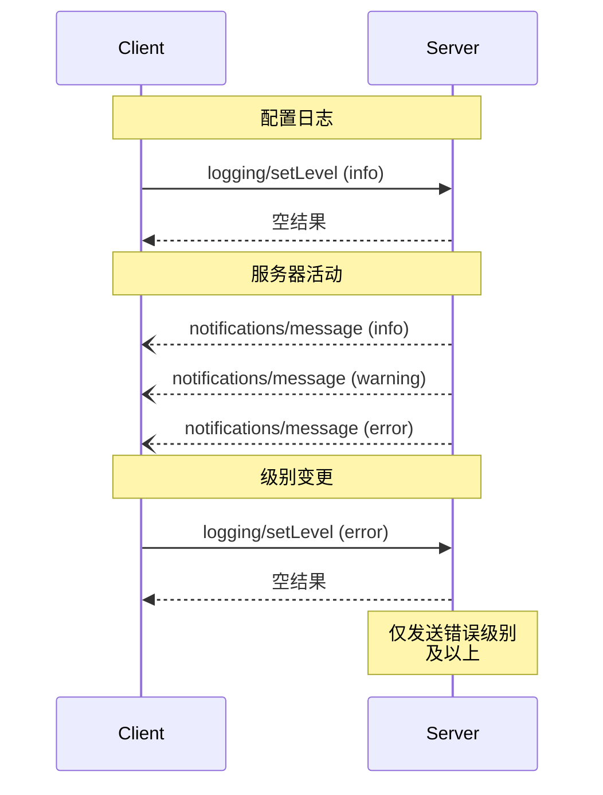

<div id="enable-section-numbers" />

<Info>**协议修订版**: draft</Info>

Model Context Protocol (MCP) 为服务器提供了一种标准化的方式来向客户端发送结构化的日志消息。客户端可以通过设置最小日志级别来控制日志详细程度，服务器发送包含严重性级别、可选的记录器名称和任意 JSON 可序列化数据的通知。

## 用户交互模型

实现可以自由地通过任何适合其需求的界面模式来暴露日志——协议本身并不强制要求任何特定的用户交互模型。

## 能力

发出日志消息通知的服务器**必须**声明 `logging` 能力：

```json
{
  "capabilities": {
    "logging": {}
  }
}
```

## 日志级别

协议遵循 [RFC 5424](https://datatracker.ietf.org/doc/html/rfc5424#section-6.2.1) 中指定的标准 syslog 严重性级别：

| 级别      | 描述             | 示例用例        |
| --------- | ---------------- | --------------- |
| debug     | 详细的调试信息   | 函数入口/出口点 |
| info      | 一般信息性消息   | 操作进度更新    |
| notice    | 正常但重要的事件 | 配置变更        |
| warning   | 警告条件         | 已弃用功能使用  |
| error     | 错误条件         | 操作失败        |
| critical  | 严重条件         | 系统组件失败    |
| alert     | 必须立即采取行动 | 检测到数据损坏  |
| emergency | 系统不可用       | 完全系统故障    |

## 协议消息

### 设置日志级别

要配置最小日志级别，客户端**可以**发送 `logging/setLevel` 请求：

**请求：**

```json
{
  "jsonrpc": "2.0",
  "id": 1,
  "method": "logging/setLevel",
  "params": {
    "level": "info"
  }
}
```

### 日志消息通知

服务器使用 `notifications/message` 通知发送日志消息：

```json
{
  "jsonrpc": "2.0",
  "method": "notifications/message",
  "params": {
    "level": "error",
    "logger": "database",
    "data": {
      "error": "连接失败",
      "details": {
        "host": "localhost",
        "port": 5432
      }
    }
  }
}
```

## 消息流程



## 错误处理

服务器**应该**为常见故障情况返回标准的 JSON-RPC 错误：

- 无效的日志级别：`-32602`（无效参数）
- 配置错误：`-32603`（内部错误）

## 实现注意事项

1. 服务器**应该**：
   - 对日志消息进行速率限制
   - 在数据字段中包含相关上下文
   - 使用一致的记录器名称
   - 移除敏感信息

2. 客户端**可以**：
   - 在 UI 中呈现日志消息
   - 实现日志过滤/搜索
   - 视觉上显示严重性
   - 持久化日志消息

## 安全

1. 日志消息**不得**包含：
   - 凭据或秘密
   - 个人识别信息
   - 可能帮助攻击的内部系统细节

2. 实现**应该**：
   - 对消息进行速率限制
   - 验证所有数据字段
   - 控制日志访问
   - 监控敏感内容
